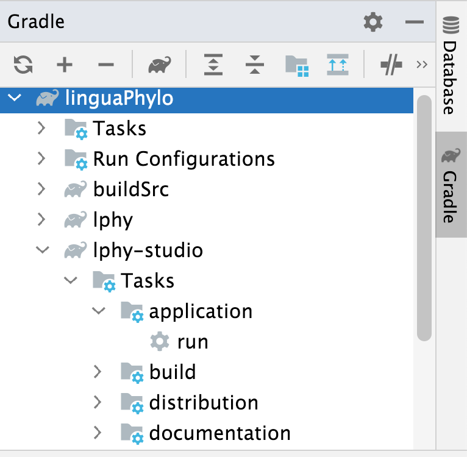

## Gradle

1. Install [OpenJDK 17](https://jdk.java.net/17/) and [Gradle 7.x](https://gradle.org/install/). 

You can look at [Setup development environment](https://linguaphylo.github.io/developer/setup-dev-env/)
for more details.

2. Always execute a build with the wrapper, as recommended by
[Gradle user guide](https://docs.gradle.org/current/userguide/gradle_wrapper.html#sec:using_wrapper),
where `--info` provides more information about the process:
   
```bash
./gradlew build --info
```

The command below makes a "clean" build by deleting previous build and ignores caching:

```bash
./gradlew clean build --info --no-build-cache
```

When you run the `build` task above, it will include `jar` task to create a jar file,
`distribution` tasks because we have defined it in the build file, as well as `test` task to run unit tests.

If you want to build without tests, you can use `-x` to exclude it:

```bash
./gradlew build -x test
```

3. Distribution of the project:

The zip file, named as "lphy-studio-${versoin}.zip", will be created
inside the sub-folder "build/distributions" under the `lphy-studio` module,
after build.

But if you want to create the zip without rebuilding the project,
you can go to the Gradle toolbar, expand lphy-studio => Tasks => distribution,
and click `distZip`.
More details about distributing jar files are available in the user guide of
[distribution plugin](https://docs.gradle.org/current/userguide/distribution_plugin.html).


4. Run LPhy studio application through Gradle:
<a href="./Gradle-run.png"></a>

```bash
./gradlew :lphy-studio:run
```

Please __note__ there are two applications in the project, so you need to specify which
subproject the task `run` is coming from, such as `:lphy-studio`. 
If the subproject is not given, then it will trigger two applications at once.

Or through IntelliJ Gradle toolbar (normally on the right side of IntelliJ window frame).
Expand lphy-studio => Tasks => application, as shown in the screenshot on the right,
and click `run`.


5. Publish to Maven central repository:

```bash
./gradlew clean
./gradlew publish --info 
    -Psigning.secretKeyRingFile=/path/to/.gnupg/mysecret.gpg 
    -Psigning.password=mypswd -Psigning.keyId=last8symbols 
    -Possrh.user=myuser -Possrh.pswd=mypswd
```

This supplies information of both your authentications for
[signing](https://docs.gradle.org/current/userguide/signing_plugin.html#sec:signatory_credentials)
and [publishing](https://docs.gradle.org/current/userguide/publishing_maven.html).

5.1 [GPG](https://central.sonatype.org/publish/requirements/gpg/)

The property `signing.password` is the passphrase of `gpg` used to protect your private key.
Run `gpg --list-keys` to find your keyId, which is a super long string 
mixed with letters and numbers, and assign the last 8 symbols to 
the property `signing.keyId` in the command line. 
Please remember to distribute your public key to a GPG keyserver before release deployment.

5.2 [Sonatype](https://central.sonatype.org/publish/publish-guide/)

`ossrh.user` and `ossrh.pswd` are used to login your JIRA account in
[Sonatype](https://central.sonatype.org/publish/publish-guide/).
If your password contains special characters, 
you can use single quotes to wrap the string to avoid errors.
More details are available in Sonatype's
[publish guide](https://central.sonatype.org/publish/publish-guide/)
and [release rules](https://central.sonatype.org/publish/release/).

**Note:** once published, you will not be able to remove/update/modify the artifact in Sonatype.
So for testing purpose, assign the `version` in `build.gradle.kts` to contain 
the suffix "-SNAPSHOT", the artifact will be published to
https://s01.oss.sonatype.org/content/repositories/snapshots/io/github/linguaphylo/,
which can be updated.

See also [Snapshot Repository vs Release Repository](https://stackoverflow.com/questions/275555/maven-snapshot-repository-vs-release-repository)
and [Best Practices for releasing with 3rd party SNAPSHOT dependencies](https://blog.sonatype.com/2009/01/best-practices-for-releasing-with-3rd-party-snapshot-dependencies/).

6. Release deployment

You need to manually [deploy](https://central.sonatype.org/publish/release/)
your release from OSSRH to the Central Repository. 

See also [Publishing your Kotlin Multiplatform library to Maven Central](https://dev.to/kotlin/how-to-build-and-publish-a-kotlin-multiplatform-library-going-public-4a8k).

### Versions

- [Declaring Versions and Ranges](https://docs.gradle.org/current/userguide/single_versions.html)


### Upgrade the wrapper 

If it is not the latest version (e.g. version 7.2 at the time of writing), 
you can use the following command to
[upgrade the wrapper](https://docs.gradle.org/current/userguide/gradle_wrapper.html#sec:upgrading_wrapper):

```bash
./gradlew -v
./gradlew wrapper --gradle-version 7.2
```

### We choose [Gradle + Kotlin](https://gradle.org/kotlin/). 

Please also see [Gradle Kotlin DSL Primer](https://docs.gradle.org/current/userguide/kotlin_dsl.html) 
and [the benefit switching from Groovy to Kotlin](https://stackoverflow.com/questions/45335874/gradle-what-is-the-benefit-if-i-switch-from-groovy-to-kotlin).

Please also see
[Declaring Dependencies between Subprojects](https://docs.gradle.org/current/userguide/declaring_dependencies_between_subprojects.html). 


## IntelliJ

- [Working with Gradle](https://www.jetbrains.com/idea/guide/tutorials/working-with-gradle/)
- [Gradle projects](https://www.jetbrains.com/help/idea/work-with-gradle-projects.html)

## Release procedure

1. Make sure all versions not containing the postfix "SNAPSHOT".
Run `./gradlew clean build --no-build-cache`, which will run all unit tests as well.
In the end, it creates a Zip file `lphy-studio-1.x.x.zip` in `$PROJECT_DIR/lphy-studio/distributions`.

2. Run the task `lphyDoc` to generate LPhy docs.
The output will be in the directory [$PROJECT_DIR/lphy/doc](lphy/doc) as default.  

For the extension developer, you need to change the script to set the arguments
passed main method in your lphyDoc from `setArgs(listOf("$version"))`
into `setArgs(listOf("$version", "$EXT_NAME", "$CLS_NAME"))`,
where $EXT_NAME is your extension name appeared in the doc title,
and $CLS_NAME is the full class name with package that implements LPhyExtension,
such as phylonco.lphy.spi.Phylonco in the Phylonco extension.

3. Create a pre-release in Github, and upload the Zip file.
In addition, if you do not publish the jars to the Maven central repository,
you need to provide the jar file and its source jar in the release. 

4. Run `./gradlew publish --info -P...` to publish to the Maven central repository. 
Please note: once published, you will not be able to remove/update/modify the jar.

5. Follow the [instruction](https://central.sonatype.org/publish/release/)
of the releasing deployment to complete publishing. 

For snapshots, check https://s01.oss.sonatype.org/content/repositories/snapshots/io/github/linguaphylo/.
For releases, check https://s01.oss.sonatype.org/content/repositories/releases/io/github/linguaphylo/.

6. After final release, it is a good behavior to instantly update your versions
in the build files into the next version with the postfix "SNAPSHOT".


