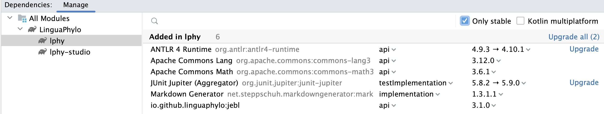

# LPhy Developer Guide 101 

The project is a Maven project. 
Please follow the instruction to load the project as a Maven project into IntelliJ.
The modules and their dependencies suppose to be automatically configured by IntelliJ.

## Setup development environment

1. Install [OpenJDK 17](https://jdk.java.net/17/), or Higher version. Try the following command line in your terminal 
to identify if you have a correct version of JDK.

```bash
java -version
```

2. Install [Git](https://github.com/git-guides/install-git) if you do not have it.

```bash
git -v
```

3. Install the latest version of [IntelliJ](https://www.jetbrains.com/idea/download/)

4. Clone the project from GitHub:

```bash
git clone https://github.com/LinguaPhylo/linguaPhylo.git
```

**Please note** all LPhy related projects must be stored as sister folders
inside one parent folder.  
In addition, please keep the original folder name when the project is cloned, 
otherwise the automatic configuration will be interrupted.

5. (Optional) install Maven. For Mac, recommend to use Homebrew:

```bash
brew install maven
```

## Folder structure

Once you cloned the project, it will look like the following structure in your computer.

```
home.dir
    ├── WorkSpace
    .     ├── linguaPhylo
    .     .    ├── bin
    .     .    ├── examples
    .     .    ├── IntelliJ
    .     .    ├── lphy
    .     .    .    └── src
    .     .    .         ├── main
    .     .    .         │    ├── java
    .     .    .         │    │     ├── lphy.core.*
    .     .    .         │    │     └── module-info.java
    .     .    .         │    └── resources
    .     .    .         └── test
    .     .    ├── lphy-base
    .     .    .    └── ...
    .     .    ├── lphy-studio 
    .     .    .    └── ...
    .     ├── LPhyBeast
    .     .    .    └── ...
    .     .
    └──...
```


## Open as project

### First time

We do not share the project settings, so that you need to copy the [setting](IntelliJ/.idea/) 
into the project root directory in order to start the project at the first time.

Go to the project root directory, for example, `~/WorkSpace/linguaPhylo` in my Mac.
Then use the 1st command to check if there `.idea/` exists. 
Only use the 2nd command to delete the previous settings, when it exists.

```bash
ls -la 
rm -r .idea/
```

In the end, use the 1st command to copy the settings, and 2nd command line to check if it is done.

```bash
cp -r ./IntelliJ/.idea/ .
ls -la .idea/
```


### If you had LPhy previously in IntelliJ


1. Delete the existing project in IntelliJ.


2. Reset the IntelliJ.  


### Dependencies

The LPhy project and its extensions use the Gradle [dependency configurations](https://docs.gradle.org/current/userguide/declaring_dependencies.html).
IntelliJ provides nice GUI to [add and manage dependencies](https://www.jetbrains.com/help/idea/work-with-gradle-dependency-diagram.html)
in your Gradle project.

<a href="./GradleDependencies.png"></a>

Please see [an example of LPhy extension](https://linguaphylo.github.io/developer/dependencies/).

When the dependencies are changed in the Gradle build, 
you can simply click the "refresh" icon in the top right corner of IntelliJ.
It will complete updates automatically.

But to update a snapshot version, which you cannot change from the dependencies in the Gradle build,
you have to click "Refresh Gradle Dependencies" to download the latest snapshot version from Maven repo.
Then click the task `clean` and `build` sequentially to rebuild the project.
See also [force updating all the snapshot Gradle dependencies in intelliJ](https://stackoverflow.com/questions/32652738/how-can-i-force-update-all-the-snapshot-gradle-dependencies-in-intellij).


## Release procedure

1. Make sure all versions not containing the postfix "SNAPSHOT".
Run `./gradlew clean build --no-build-cache`, which will run all unit tests as well.
In the end, it creates a Zip file `lphy-studio-1.x.x.zip` in `$PROJECT_DIR/lphy-studio/distributions`.

2. Run the task `lphyDoc` to generate LPhy docs.
The output will be in the directory [$PROJECT_DIR/lphy/doc](lphy/doc) as default.  

For the extension developer, you need to change the script to set the arguments
passed main method in your lphyDoc from `setArgs(listOf("$version"))`
into `setArgs(listOf("$version", "$EXT_NAME", "$CLS_NAME"))`,
where $EXT_NAME is your extension name appeared in the doc title,
and $CLS_NAME is the full class name with package that implements LPhyExtension,
such as phylonco.lphy.spi.Phylonco in the Phylonco extension.

3. Create a pre-release in Github, and upload the Zip file.
In addition, if you do not publish the jars to the Maven central repository,
you need to provide the jar file and its source jar in the release. 

4. Run `./gradlew publish --info -P...` to publish to the Maven central repository. 
Please note: once published, you will not be able to remove/update/modify the jar.

5. Follow the [instruction](https://central.sonatype.org/publish/release/)
of the releasing deployment to complete publishing at https://s01.oss.sonatype.org/.

For snapshots, check https://s01.oss.sonatype.org/content/repositories/snapshots/io/github/linguaphylo/.
For releases, check https://s01.oss.sonatype.org/content/repositories/releases/io/github/linguaphylo/.

### Tips:

- After final release, it is a good behavior to instantly update your versions
  in the build files into the next version with the postfix "SNAPSHOT".
- After release, the version will immediately appear in the s01.oss,
  but it will take one/two days to synchronise to [Maven Central Repository](https://central.sonatype.com).
  For example, https://repo.maven.apache.org/maven2/io/github/linguaphylo/.

## Useful Links

- [LPhyBEAST developer note](https://github.com/LinguaPhylo/LPhyBeast/blob/master/DEV_NOTE.md)

- [Maven linguaphylo group](https://search.maven.org/search?q=io.github.linguaphylo)
