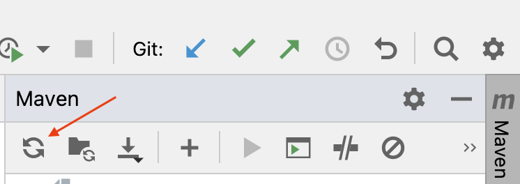
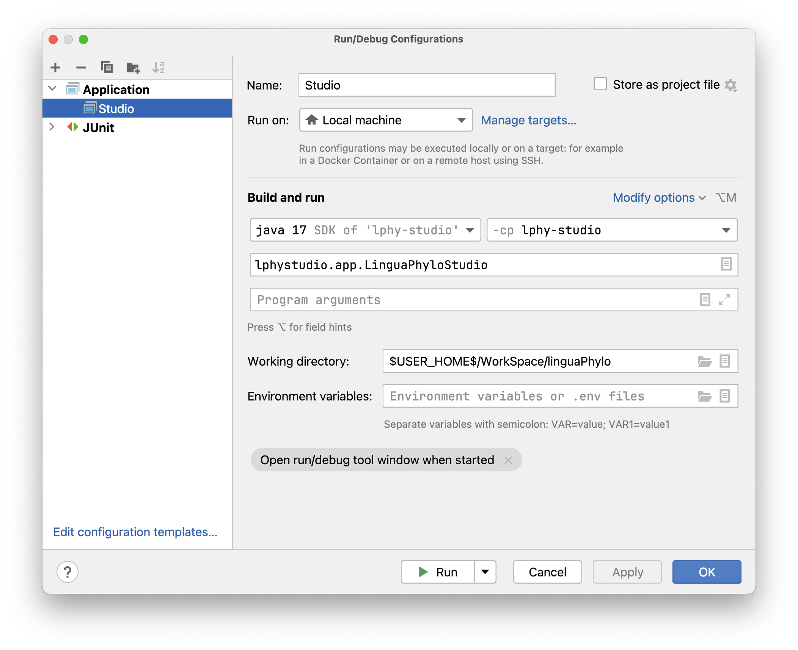

# LPhy Developer Guide 101 (Development Environment)

This is the first tutorial for LPhy developers. 
It focuses on how to set up IntelliJ for the LPhy project and some basic skills for working with it.

## Setup development environment

We use the Maven "pom.xml" to automatically configure the modules and their dependencies 
in the IntelliJ project, but we do **not** recommend using Maven to build, run, debug, or test. 
Please follow the instructions to load the project:

1. [Install OpenJDK 17](https://jdk.java.net/17/), or Higher version. Try the following command line in your terminal 
to identify if you have a correct version of JDK.

```bash
java -version
```

Here is a simple [tutorial for Java](https://www.w3schools.com/java/). 
There are also many good Java tutorials available, just Google it.

2. [Install Git](https://github.com/git-guides/install-git) if you do not have it.

```bash
git -v
```

Here is a simple [tutorial for Git](https://www.w3schools.com/git/).

3. Install the latest version of [IntelliJ](https://www.jetbrains.com/idea/download/)

4. Clone the project from GitHub:

```bash
git clone https://github.com/LinguaPhylo/linguaPhylo.git
```

More projects are using this as a core, such as: 

- [LPhyBeast](https://github.com/LinguaPhylo/LPhyBeast)
- [Phylonco](https://github.com/bioDS/beast-phylonco)
- [LPhyBeastExt](https://github.com/LinguaPhylo/LPhyBeastExt)
- [ToroidalDiffusion](https://github.com/alexeid/toroidalDiffusion)

5. (Optional) install Maven if you want to use it in the terminal. For Mac, recommend to use Homebrew:

```bash
brew install maven
```

## Folder structure

Once you have cloned the project, it will appear in the following structure on your computer.

**Please note** all LPhy-related projects must be stored as sibling folders inside one parent folder. 
Additionally, please keep the original folder name when cloning the project; 
otherwise, the automatic configuration will be disrupted.

```
home.dir
    ├── WorkSpace
    .     ├── linguaPhylo
    .     .    ├── bin
    .     .    ├── examples
    .     .    ├── IntelliJ
    .     .    ├── lphy
    .     .    .    └── src
    .     .    .         ├── main
    .     .    .         │    ├── java
    .     .    .         │    │     ├── lphy.core.*
    .     .    .         │    │     └── module-info.java
    .     .    .         │    └── resources
    .     .    .         └── test
    .     .    ├── lphy-base
    .     .    .    └── ...
    .     .    ├── lphy-studio 
    .     .    .    └── ...
    .     ├── LPhyBeast
    .     .    .    └── ...
    .     .
    └──...
```

Some concepts:

- `home.dir` represents your [home directory](https://en.wikipedia.org/wiki/Home_directory), which is also known as `~` in Linux or Mac.
- `WorkSpace` is the parent folder to keep all LPhy projects, which can be any names.
- `linguaPhylo` is the project root directory for the linguaPhylo project.
- `lphy`, `lphy-base`, and `lphy-studio` contains the tree modules defined in the linguaPhylo project.
- `LPhyBeast` is the project root directory for the LPhyBeast project.

Here is a tutorial for [Multi-module projects](https://www.jetbrains.com/guide/java/tutorials/marco-codes-maven/multi-module-projects/) for your interest.

## Load as a Maven project in IntelliJ

**Please note** we do not share the project settings, so please do **not** change your git settings
to commit any IntelliJ project settings.
However, we provide the project settings in another directory called [IntelliJ](IntelliJ/.idea/).
After following the instruction below, 
you can simply load the project by selecting the directory, not the pom file.

### First time to use

For the initial setup of the project, you need to copy the [settings](IntelliJ/.idea/)
into the project root directory to start the project.

Navigate to the project root directory, for example, `~/WorkSpace/linguaPhylo` on my Mac. 
Use the first command to check if the hidden folder `.idea/` exists. 
Only use the second command to delete it if it exists.

```bash
ls -la 
rm -r .idea/
```

Then, use the first command to copy the settings, and the second command to check if it is done.

```bash
cp -r ./IntelliJ/.idea/ .
ls -la .idea/
```

We recommend you to [clear the IntelliJ caches](https://www.jetbrains.com/help/idea/invalidate-caches.html)
by selecting all options before importing the project. 
Once cleared, start IntelliJ and click the `Open` button to select the project root directory. 
IntelliJ will open it as a Maven project (please refer to "LPhy Developer Guide 103" if you are unfamiliar with this process).

Wait for IntelliJ to download all dependencies and complete indexing,
this typically takes about one minute. 
Once done (when no progress bar appears at the bottom), 
you should see the Maven icon on the right side of IntelliJ. 
Check for any red lines under any Maven tasks, as these indicate problems.

Once the project is successfully imported, it should look like this:

<a href="./figs/IntelliJLPhy.png"></a>

### Build project

The final step is to build the Java project. Simply go to the "Build" menu, 
click "Rebuild Project," and wait until the building process finishes.

Please do **not** select "Delegate IDE build/run actions to Maven", it is unchecked as default.

<a href="./figs/BuildMaven.png"></a>

### Project settings

After the project is imported, IntelliJ will automatically configure the project settings and modules. 
You can view these settings through [Project Structure](https://www.jetbrains.com/help/idea/project-settings-and-structure.html).
Please leave the "compiler output" blank so that we can utilize the Maven output directory named "target." 
Otherwise, IntelliJ will create an additional folder named "out" for each module.

<a href="./figs/ProjectStructure.png"></a>

You can also click "Modules" to look at the dependencies. 
They are configured by "pom.xml", and do **not** change them manually.

### Reload all Maven projects

One convenient feature is that you can easily recover or update the settings and dependencies by clicking the cycle icon, 
known as ["Reload All Maven Projects"](https://www.jetbrains.com/help/idea/delegate-build-and-run-actions-to-maven.html#maven_reimport),
located in the Maven window on the right side. 
This is useful when settings have been changed accidentally or updated by core developers.

<a href="./figs/ReloadMaven.png"></a>

### Troubleshooting

You can skip this section if you are setting up the project for the first time 
or if your project has been successfully imported following the instructions above.

If you previously had any LPhy-related projects (version 1.6.* or earlier) in IntelliJ, 
or if you encountered any issues during the import process, please follow the steps below:

1. Delete all existing projects in IntelliJ.

2. Delete all cloned LPhy projects, and clone a new copy again.  

3. [Clear the IntelliJ caches](https://www.jetbrains.com/help/idea/invalidate-caches.html)
   by selecting all options.

4. Repeat the process in [the "First time" section](#First-time-to-use).


## Working inside IntelliJ

We use "pom.xml" to configure the LPhy related projects,
but we recommend using IntelliJ to build, run, debug, or test.  

### Standard directory layout

Please understand the [standard directory layout](https://maven.apache.org/guides/introduction/introduction-to-the-standard-directory-layout.html) 
of Maven project before you continue.

### Build

Always use IntelliJ to build or rebuild the project. 
The technical details can be found [here](https://www.jetbrains.com/help/idea/compiling-applications.html).
Since we use Maven to automatically configure the modules, 
you don’t need to worry about the settings mentioned in the linked tutorial.

### Run / Debug / Test

Follow the tutorial on [run/debug configuration](https://www.jetbrains.com/help/idea/run-debug-configuration.html)
to run your Java applications or unit tests from IntelliJ. 
For example, the screenshot below shows a configuration to run LPhy Studio from the linguaPhylo project. 
Ensure that the working directory is set to the parent folder of the "examples" folder, 
which contains all LPhy scripts. 
This setting allows the studio to locate the LPhy scripts and list them in the "File" menu.

<a href="./figs/RunStudio.png"></a>


### Commit

It is recommended to use IntelliJ for committing your changes, as it provides a user-friendly GUI. 
However, you will need to adjust the default settings for the view options.

First, open the "Commit" window, usually located on the left side or in the bottom toolbar. 
If you cannot find it, go to the "Git" menu and click "Commit...".

Next, locate the icon that looks like an eye, known as "View Options," 
and select all three options under "Group By," as shown below. 
This will group the changes by repository, directory, and module, 
helping you identify what you have changed and what you need to commit.

<a href="./figs/CommitView.png"></a>

## Developer tips

1. Check what you are going to commit before you actually commit.

2. Always `git pull` before `git commit`.

3. If you encounter issues with dependencies or need to update them, 
simply [clear the IntelliJ caches](https://www.jetbrains.com/help/idea/invalidate-caches.html) by selecting all options, 
and then [reload all Maven projects](#reload-all-maven-projects).

## Next

- [LPhy Developer Guide 101b (Multi-Module Maven Projects)](DEV_NOTE1.md)

- [LPhy Developer Guide 102 (LPhy in Java)](DEV_NOTE2.md)  in dev ...

- [LPhy Developer Guide 103 (Maven project)](DEV_NOTE3.md) 

- [Advanced developer guide]()  coming soon ...

- [LPhyBeast developer guide]()  coming soon ...

## Useful Links

- [LPhy home page](https://linguaphylo.github.io/)

- [Well-calibrated study](https://www.biorxiv.org/content/10.1101/2024.02.11.579856v1.full)

