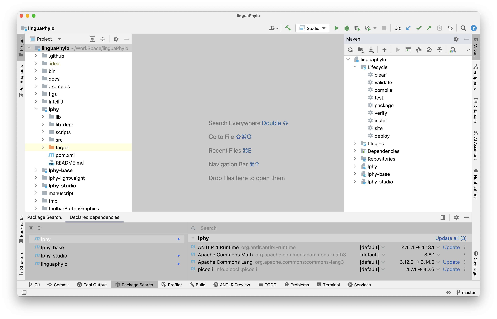
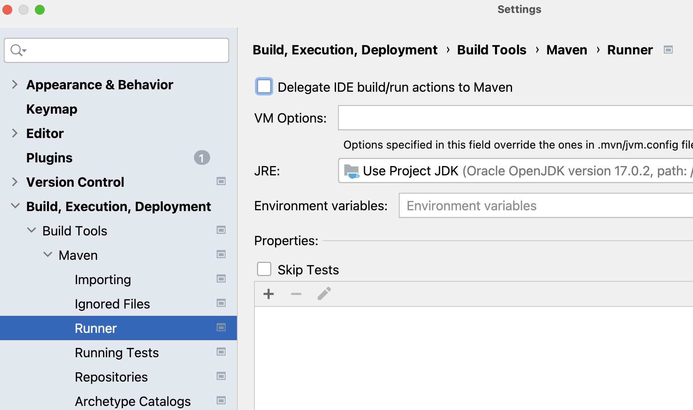
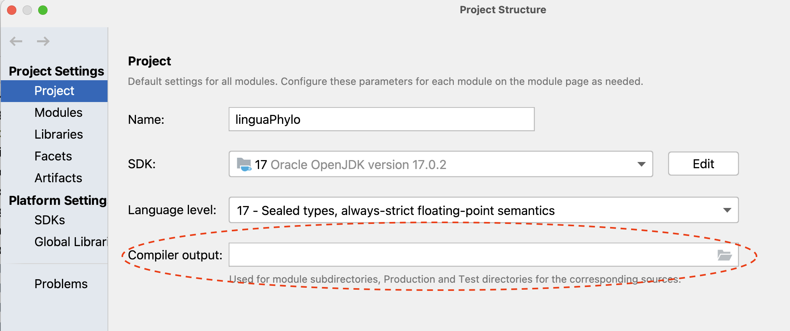
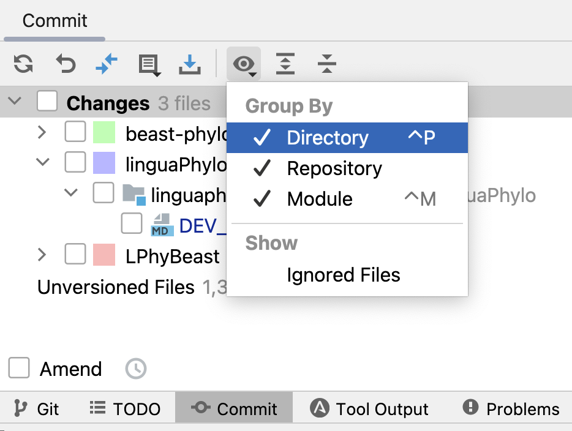

# LPhy Developer Guide 101 

We set up the project as a Maven project, 
but we do not use Maven to build project in IntelliJ.
Please follow the instruction to load the project,
and the modules and their dependencies will be automatically configured by IntelliJ.

## Setup development environment

1. [Install OpenJDK 17](https://jdk.java.net/17/), or Higher version. Try the following command line in your terminal 
to identify if you have a correct version of JDK.

```bash
java -version
```

2. [Install Git](https://github.com/git-guides/install-git) if you do not have it.

```bash
git -v
```

Here is a simple [tutorial for Git](https://www.w3schools.com/git/).

3. Install the latest version of [IntelliJ](https://www.jetbrains.com/idea/download/)

4. Clone the project from GitHub:

```bash
git clone https://github.com/LinguaPhylo/linguaPhylo.git
```

More projects are using this as a core, such as: 

-[LPhyBeast](https://github.com/LinguaPhylo/LPhyBeast)
- [Phylonco](https://github.com/bioDS/beast-phylonco)
- [LPhyBeastExt](https://github.com/LinguaPhylo/LPhyBeastExt)
- [ToroidalDiffusion](https://github.com/alexeid/toroidalDiffusion)

5. (Optional) install Maven if you want to use it in the terminal. For Mac, recommend to use Homebrew:

```bash
brew install maven
```

## Folder structure

Once you cloned the project, it will look like the following structure in your computer.

**Please note** all LPhy related projects must be stored as sister folders
inside one parent folder.  
In addition, please keep the original folder name when the project is cloned,
otherwise the automatic configuration will be interrupted.

```
home.dir
    ├── WorkSpace
    .     ├── linguaPhylo
    .     .    ├── bin
    .     .    ├── examples
    .     .    ├── IntelliJ
    .     .    ├── lphy
    .     .    .    └── src
    .     .    .         ├── main
    .     .    .         │    ├── java
    .     .    .         │    │     ├── lphy.core.*
    .     .    .         │    │     └── module-info.java
    .     .    .         │    └── resources
    .     .    .         └── test
    .     .    ├── lphy-base
    .     .    .    └── ...
    .     .    ├── lphy-studio 
    .     .    .    └── ...
    .     ├── LPhyBeast
    .     .    .    └── ...
    .     .
    └──...
```

Some concepts:

- `home.dir` represents your [home directory](https://en.wikipedia.org/wiki/Home_directory), which is also known as `~` in Linux or Mac.
- `WorkSpace` is the parent folder to keep all LPhy projects, which can be any names.
- `linguaPhylo` is the project root directory for the linguaPhylo project.
- `lphy`, `lphy-base`, and `lphy-studio` contains the tree modules defined in the linguaPhylo project.
- `LPhyBeast` is the project root directory for the LPhyBeast project.

Here is a tutorial for [Multi-module projects](https://www.jetbrains.com/guide/java/tutorials/marco-codes-maven/multi-module-projects/).

## Maven project 

Here are two tutorials for importing a Maven project to IntelliJ :

- [Importing a Maven project](https://www.jetbrains.com/guide/java/tutorials/working-with-maven/importing-a-project/)
- [Add Maven support to an existing project](https://www.jetbrains.com/help/idea/convert-a-regular-project-into-a-maven-project.html)

**Please note** we provide the project settings in another directory called [IntelliJ](IntelliJ/.idea/). 
After following the instruction below, you can simply load the project by selecting the directory not pom file. 

### First time

We do not share the project settings, so please **do not** change your git settings 
to commit any IntelliJ project settings.
For the first time to set up the project, you need to copy the [settings](IntelliJ/.idea/) 
into the project root directory in order to start the project.

Go to the project root directory, for example, `~/WorkSpace/linguaPhylo` in my Mac.
Use the 1st command to check if the hidden folder `.idea/` exists. 
Only use the 2nd command to delete it, when it exists.

```bash
ls -la 
rm -r .idea/
```

Then, use the 1st command to copy the settings, and 2nd command line to check if it is done.

```bash
cp -r ./IntelliJ/.idea/ .
ls -la .idea/
```

We recommend you to [clear the IntelliJ caches](https://www.jetbrains.com/help/idea/invalidate-caches.html)
by selecting all options before importing the project.
Now you can start the IntelliJ, and click the `Open` button to select the project root directory.
IntelliJ will open it as a Maven project (please go through the above tutorials if you are not familiar with this process).

Wait for IntelliJ to download all dependencies and make indexing, it normally takes about one minute.
After it is done (no progress bar appears on the bottom), your IntelliJ should have the Maven icon on the right side.
Check if there is any red line under any Maven tasks, which is indicating a problem.

Once the project is successfully imported, it should look like:

<a href="./figs/IntelliJLPhy.png"></a>

### Build project

The final step is to build the Java project. Simply go to the menu "Build", 
click the "Rebuild Project", and wait until the building process finishes.

Please **do not** select "Delegate IDE build/run actions to Maven", it is unchecked as default.

<a href="./figs/BuildMaven.png"></a>

### Project settings

After the project is imported, the project settings and modules will be automatically configured by IntelliJ.
You can view them though [Project Structure](https://www.jetbrains.com/help/idea/project-settings-and-structure.html).
Please keep the compiler output as the blank, so that we can use the Maven output directory named as "target",
otherwise IntelliJ will produce an additional folder named as "out" for each module. 

<a href="./figs/ProjectStructure.png"></a>

You can also click "Modules" to look at the dependencies. They are configured by "pom.xml".
The nice thing is that you can simply recover or update the settings and dependencies by clicking the cycle icon, 
called as ["Reload All Maven Projects"](https://www.jetbrains.com/help/idea/delegate-build-and-run-actions-to-maven.html#maven_reimport), 
in the Maven windows on the right side, 
when either they are changed accidentally or updated by core developers.

### If you had LPhy previously in IntelliJ

You can skip this section, if you are the first time to set up the project 
or your project has been successfully imported following the instructions above. 

If you had any LPhy related projects previously (below version 1.6.*) in IntelliJ,
or you have a problem during the importing,
you can follow the following steps: 

1. Delete all existing projects in IntelliJ.

2. Delete all cloned LPhy projects, and clone a new copy again.  

3. [Clear the IntelliJ caches](https://www.jetbrains.com/help/idea/invalidate-caches.html)
   by selecting all options.

4. Repeat the process in [the "First time" section](#First-time).

## Working inside IntelliJ

We use "pom.xml" to configure the project,
but we do not use Maven instead use IntelliJ to build/run/debug the project.

### Standard directory layout

Please understand the [standard directory layout](https://maven.apache.org/guides/introduction/introduction-to-the-standard-directory-layout.html) 
of Maven project before you continue.

### Build


### Run 


### Debug


### Test


### Commit

It is recommended to use IntelliJ to commit your changes. 
It provides a nice GUI, but you need to change the default settings for view option.
First, open the "Commit" window, it is usually located on the left side or bottom toolbar.
If you cannot find it, go to the menu "Git", and click the "Commit...".

Then find the icon looking like an eye, which is called as "View Options", 
and select all options three under "Group By", as shown below. 
This makes the changes grouped by repository, directory and module.
It helps you to identify what you have changed and what you suppose to commit.

<a href="./figs/CommitView.png"></a>

## Developer tips

1. Check what you are going to commit before you actually commit.


2. Always `git pull` before `git commit`.


## Useful Links

- [Maven in 5 Minutes](https://maven.apache.org/guides/getting-started/maven-in-five-minutes.html)

- [Advanced developer guide]()

