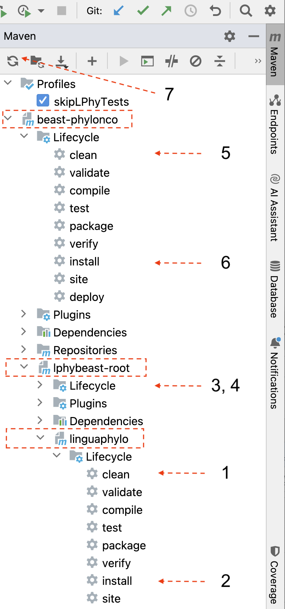

# LPhy Developer Guide 101b (Multi-Module Maven Projects)

Working on an LPhy or LPhyBeast project typically requires managing dependencies across multiple modules or even repositories. 
As a developer, it’s essential to be familiar with how to update these dependencies by Maven and 
build the Java project in such cases.

## Dependency resolution and compilation/build

Before reading this section, you are assumed already having the knowledge of [dependency resolution](https://www.jetbrains.com/help/idea/work-with-maven-dependencies.html) 
and compilation/build Java source code. 

Here’s a breakdown of each:

### Updating Dependencies by Maven

This is typically done with the `mvn install` command (for compiling and installing the project in the local repository).

This process resolves and downloads the necessary dependencies required by the project. 
Maven checks the `pom.xml` files for all modules or projects to find any specified dependencies, 
which may include external libraries, parent or sibling projects, and plugins. 
It then downloads any missing dependencies or updates existing ones in the local repository (`~/.m2/repository`).

More details are available in [LPhy Developer Guide 103 (Maven project)](./DEV_NOTE3.md)

### Building a Java Project:

It is simply using IntelliJ menu [Build => Rebuild Project](https://www.jetbrains.com/help/idea/compiling-applications.html#rebuild_project).

This process originally only compiles the Java source code in IntelliJ. But in Maven project, it also involves running tests, 
and packaging the code into an artifact (such as a .jar or .war file) based on the configurations in the pom.xml file.
The runnable or deployable artifact will be generated in the `target` folder.

Maven uses plugins (like the maven-compiler-plugin) to compile Java files and handle other phases (e.g., testing, packaging).
In a multi-module project, it ensures that all modules compile successfully and have all necessary dependencies.

### Workflow for Multi-Module Maven Projects in IntelliJ

After making significant changes in one module, especially changing version number, you can follow the steps below: 

1. Run `mvn clean` followed by `mvn install` **only** for the project root module. 
Begin with the project that has the fewest dependencies (such as linguaPhylo) 
and complete the process with your active working project.

The screenshot on the right demonstrates the recommended order for executing these tasks.

2. Use IntelliJ's ["Reload All Maven Projects"](https://www.jetbrains.com/help/idea/delegate-build-and-run-actions-to-maven.html#maven_reimport) option to force IntelliJ to re-import the updated dependencies if necessary.

3. Rebuild the Project within IntelliJ. 

If there are build issues after re-importing the updated Maven dependencies, please try to repeat 2 a couple of times. 
If the problem is persisting, try to restart IntelliJ by [clearing the caches](https://www.jetbrains.com/help/idea/invalidate-caches.html), and repeat the above steps.

