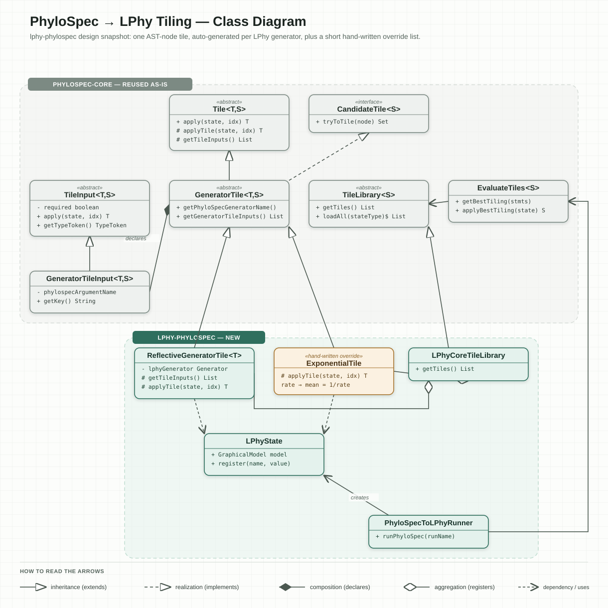

# lphy-phylospec: class design summary

Companion to `DESIGN.md`. Summarizes, per class, what each proposed class in the
`lphy-phylospec` module layout does and how it plugs into `phylospec-core`'s existing tiling
framework, followed by a class diagram.

## Classes

### `LPhyState` (`tiling/LPhyState.java`)

The accumulator object threaded through tiling — the `S` type parameter in `Tile<T, S>`, passed
into every `Tile.apply(state, …)` call and populated incrementally as each statement's tile
applies. Wraps a live `lphy.core.parser.graphicalmodel.GraphicalModel` and holds a `name → Value<?>` lookup so
later statements can reference values earlier statements produced. Deliberately thin: LPhy's
`GraphicalModel` is already runnable/printable once populated, so there's no separate "assemble
into a runnable object" step to hand-build on top of it.

### `ReflectiveGeneratorTile` (`tiling/ReflectiveGeneratorTile.java`)

The auto-generation engine. One concrete `GeneratorTile<T, LPhyState>` subclass, **instantiated
once per known LPhy generator** (not subclassed per generator, unlike hand-written tiles).
Each instance is built at library-construction time from one generator class's metadata — `@GeneratorInfo`
lives on that class's execution method (`sample()` for a distribution, `apply()` for a deterministic
function), while `@ParameterInfo` lives on its constructor's parameters — and overrides:

- `getPhyloSpecGeneratorName()` — returns the generator's resolved PhyloSpec name.
- `getTileInputs()` — normally reflects over declared Java fields; here it's overridden to build
  `GeneratorTileInput`s dynamically from the generator's `ParameterInfo` list instead.
- `getTypeToken()` (on each dynamic input, and on the tile itself) — normally inferred from a
  declared field's or subclass's generic type; here it must be supplied explicitly from the
  generator's reflected parameter/return types via `TypeToken.of(...)`. This is also where the
  LPhy→PhyloSpec type-name translation has to happen: `ComponentLibraryExporter` (the JSON export)
  no longer does this translation — it reports LPhy's own literal types (`Double[]`, `Object`, ...)
  — so this method must itself turn a reflected `Double[]` into the `TypeToken` for PhyloSpec's
  `Vector<Real>`, not assume that work is already done. See `DESIGN.md`'s "Type-name mapping"
  section for the specifics (the numeric refinement lattice, the `Double`/`Number` many-to-one
  mapping, and the `Vector<T>` translation) this method needs to reconstruct.
- `applyTile(...)` — resolves each input to a `Value<?>`, then calls LPhy's existing
  `ParserUtils.getMatchingFunctions(name, args)` to reflectively construct the right LPhy object
  and register it into `LPhyState`. This is the generic equivalent of what a hand-written override
  tile (e.g. `ExponentialTile`, below) does by hand for one specific generator.

### `tiles/*.java` — hand-written override tiles (e.g. `ExponentialTile`)

Escape hatch for genuine PhyloSpec↔LPhy parameterization mismatches (e.g. `rate` vs `mean = 1/rate`).
A normal `GeneratorTile<T, LPhyState>` subclass with statically declared `GeneratorTileInput`
fields (so the base reflection-over-fields path in `Tile.getTileInputs()` works unmodified) and an
`applyTile` that does the real algebra before pushing the result into `LPhyState`. Registered ahead
of the reflective sweep so it takes priority for its generator name.

### `LPhyCoreTileLibrary` (`tiling/LPhyCoreTileLibrary.java`)

Implements `TileLibrary<LPhyState>`. Its `getTiles()`:

1. Instantiates all hand-written override tiles first.
2. Reflectively enumerates every LPhy generator class exposing a `@GeneratorInfo`-annotated method
   that isn't already covered by an override tile, and wraps each in a `ReflectiveGeneratorTile`.
3. Applies the name-collision safety net: fails/logs if an auto-derived PhyloSpec name collides
   with a *different* generator already declared in `phylospec-core-component-library.json`.

Registered as a Java SPI provider (`META-INF/services/org.phylospec.tiling.TileLibrary` +
`module-info.java`'s `provides ... with LPhyCoreTileLibrary`) so `TileLibrary.loadAll(LPhyState.class)`
discovers it automatically — no wiring needed in the runner.

### `PhyloSpecToLPhyRunner` (`runner/PhyloSpecToLPhyRunner.java`)

Orchestration only: lex → parse → AST transforms →
`VariableResolver`/`TypeResolver`/`StochasticityResolver` → build `EvaluateTiles<LPhyState>` from
`TileLibrary.loadAll(LPhyState.class)` → `getBestTiling` → `applyBestTiling(new LPhyState(...))`.
No object-graph assembly step of its own — it just hands the populated `LPhyState`'s
`GraphicalModel` to LPhy's existing sampler or script printer.

### `module-info.java` + `META-INF/services`

Pure plumbing: declares the `TileLibrary` SPI provider, and `opens` the tiling package(s) to
`org.phylospec.core` so the framework's field-reflection (`Tile.getTileInputs()`,
`GeneratorTile.toString()`) can reach the hand-written tiles' declared fields across the module
boundary.

## Class diagram

Framework classes from `phylospec-core` (unchanged, reused as-is) are grouped in the grey
package region; new classes in `lphy-phylospec` are grouped in the teal region below, with the
one hand-written override tile (`ExponentialTile`) marked amber. See
[`class-diagram.svg`](class-diagram.svg) — open it directly in a browser or image viewer for a
sharp, zoomable view; it's plain hand-authored SVG, so it's editable as text and has no build
step or external renderer to keep in sync.

