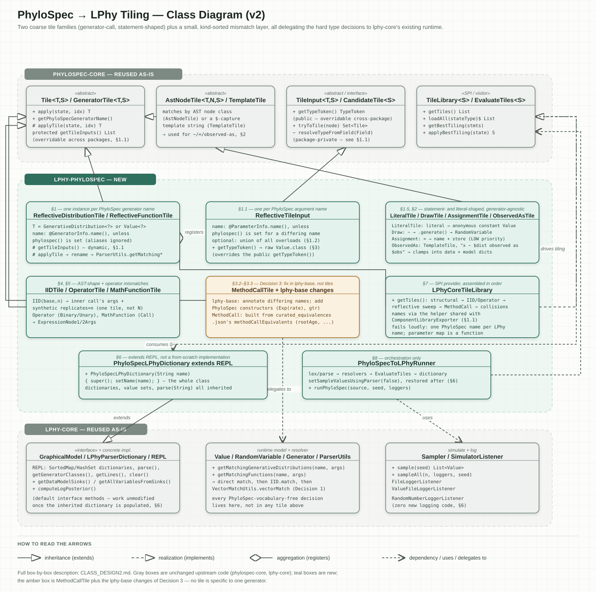

# lphy-phylospec: class design v2

This document specifies how a PhyloSpec script becomes a live, sample-able, loggable LPhy model.
`phylospec-core`'s tiling framework is reused unmodified ([Design principles](#design-principles)):
each PhyloSpec AST node is mapped to a real LPhy object by a small taxonomy of tiles (§1–§5),
accumulated into `PhyloSpecLPhyDictionary` (§6) — an `LPhyParserDictionary` extending LPhy's own
`REPL` — and driven end to end by `PhyloSpecToLPhyRunner` (§8) via `LPhyCoreTileLibrary` (§7).
Every LPhy-specific decision — type resolution, vectorization, overload matching — is delegated to
LPhy's existing runtime (`ParserUtils`, `Sampler`) rather than reimplemented.

## Project structure

The class diagram (`class-diagram2.svg`, reproduced at the end of this document) groups every class
into three regions:

- **`phylospec-core`** — the tiling framework: `Tile`, `GeneratorTile`, `AstNodeTile`,
  `TemplateTile`, `TileInput`, `TileLibrary`, `EvaluateTiles`. Reused without modification.
- **`lphy-phylospec`** — the module this document specifies: the tile classes that map PhyloSpec
  AST shapes onto LPhy objects (§1–§5), the `PhyloSpecLPhyDictionary` accumulator (§6), the
  `LPhyCoreTileLibrary` that registers every tile (§7), and the `PhyloSpecToLPhyRunner`
  orchestrator (§8).
- **`lphy-core`** — LPhy's existing runtime: `GraphicalModel`, `Value`, `RandomVariable`,
  `Generator`, `ParserUtils`, `Sampler`. Reused without modification.

## Design principles

Two decisions shape everything that follows.

**Decision 1 — delegate type, overload, and vectorization resolution to `ParserUtils`.** LPhy
already provides a complete, tested resolver from "generator name + argument values" to a
constructed object (`ParserUtils.getMatchingGenerativeDistributions`/`getMatchingFunctions` →
`constructGenerator`), which tries a direct constructor match, then `IID.match` (explicit
`replicates=n`), then `VectorMatchUtils.vectorMatch` (implicit vectorization), in that order
(`LPhyFramework.md` §4). Each of these is a runtime, argument-shape-driven decision, not a
static-type one. Rather than have `phylospec-core`'s `TypeToken` machinery encode PhyloSpec's
numeric refinement lattice (`Real ⊃ NonNegativeReal ⊃ PositiveReal, ...`) or the `Vector<T>`/
`Double[]` translation, every reflective tile declares its inputs and its own produced type with
one deliberately coarse Java shape — `lphy.core.model.Value<?>`, raw and unparameterized — and
defers every finer-grained decision to `ParserUtils` at `applyTile()` time, exactly as happens for
hand-written `.lphy` scripts. §3 gives the justification for why this is sound rather than merely
convenient.

**Decision 2 — model PhyloSpec statements (`~`, `=`, `observed as`) as their own generator-agnostic
tiles.** A PhyloSpec script is a sequence of statements, not only a set of generator calls. LPhy
distinguishes a `~` draw (produces a `RandomVariable` via `.sample()`) from an `=` assignment
(produces a plain `Value` via `.apply()`) from data clamping (a value that is both drawn and
observed) — `LPhyFramework.md` §2. This design gives each of these its own generator-agnostic tile,
detailed in §2.

## Workflow

```
.phylospec source
  │  Lexer / Parser, AST transforms, VariableResolver / TypeResolver / StochasticityResolver
  ▼                                                                    (phylospec-core, unchanged)
type-checked, stochasticity-annotated AST
  │  EvaluateTiles<PhyloSpecLPhyDictionary>.getBestTiling(...)
  ▼                                                                    (phylospec-core, unchanged)
one Tile per statement, drawn from LPhyCoreTileLibrary
  │  applyBestTiling(new PhyloSpecLPhyDictionary(name))
  ▼                                                                          (lphy-phylospec — §1–§7)
PhyloSpecLPhyDictionary
  │  Sampler / SimulatorListener, CanonicalCodeBuilder
  ▼                                                                       (lphy-core, unchanged)
simulated values, logged output, and/or exported .lphy text
```

The PhyloSpec AST is parsed and type-checked entirely by `phylospec-core`; nothing in
`lphy-phylospec` touches that stage. Tiling then converts the AST into LPhy objects in a single
pass: applying a tile constructs the real LPhy `Value` or `Generator` for the AST node it covers,
by delegating to `ParserUtils` — LPhy's own name/argument resolver (Decision 1, above) — and, for a
statement-level tile, additionally registers the resulting named value into
`PhyloSpecLPhyDictionary`'s data or model dictionary (§2).

Converting an AST node into an LPhy object and registering it in the dictionary are not two
sequential phases. `PhyloSpecLPhyDictionary` does not accumulate objects and then separately
assemble a graph from them — it *is* the graphical model. As with a hand-written `.lphy` script,
the graph is never stored as an explicit structure: each `Value` holds a reference to the
`Generator` that produced it, and each `Generator` holds its own parameter `Value`s
(`LPhyFramework.md` §3). The model graph is therefore implicit in these object references from the
moment a tile constructs an object, and is only ever recovered by traversal — when locating sinks,
computing the log posterior, or printing a script (§6.1). Storing a named result in
`PhyloSpecLPhyDictionary` and constructing the graphical model are the same act, not two.

## 1. Generator-call tiles

### `ReflectiveDistributionTile` / `ReflectiveFunctionTile` (`tiling/`)

Two small, near-identical `GeneratorTile<T, PhyloSpecLPhyDictionary>` subclasses — one instance per
known LPhy generator name, not one hand-written Java class per generator — split along LPhy's own
kind distinction:

| | `ReflectiveDistributionTile` | `ReflectiveFunctionTile` |
|---|---|---|
| Backs | `GenerativeDistribution` classes | `BasicFunction`/`DeterministicFunction` classes |
| `T` | `GenerativeDistribution<?>` — the **unsampled** distribution object, matching PhyloSpec's own `Distribution<T>` call-expression type | `Value<?>` — the fully realized value, since `=`-shaped calls (`jc69(...)`) are ordinary value expressions usable anywhere, including nested inside another call's arguments, with no statement wrapper needed |
| `getPhyloSpecGeneratorName()` | `@GeneratorInfo.phylospec()`, falling back to the LPhy name (`GeneratorUtils.getGeneratorName`). Both fields are already present on `GeneratorInfo`/`ParameterInfo` in `lphy-core` | same |
| `getTileInputs()` | overridden (§1.1) | overridden (§1.1) |
| `applyTile(state, ...)` | resolves each input (§1.1), calls `ParserUtils.getMatchingGenerativeDistributions(name, argMap)`, picks the match (§1.3), wires outputs (§1.4), returns the `GenerativeDistribution` without sampling it | same, but calls `getMatchingFunctions`, wires outputs (§1.4), and returns `generator.generate()` — a `Value<T>` — directly |

Splitting by kind, rather than using one branchy tile, mirrors LPhy's own clean split and keeps
each `T` precise enough that `getTypeToken()` needs no per-instance override (§3).

### 1.1 `getTileInputs()`: built dynamically, using a custom `TileInput`

`Tile.getTileInputs()` normally works by field reflection: it walks
`this.getClass().getDeclaredFields()` for `TileInput`-typed fields and, for each, calls the
package-private `TileInput.resolveTypeFromField(Field)` to pull `T` out of the field's own generic
signature (`TileInput.java:36`). A reflective tile has no such fields — its parameter list is only
known once the wrapped LPhy generator class is reflected — so `getTileInputs()` is overridden to
build `GeneratorTileInput`s from `GeneratorUtils.getParameterInfo(constructor)` instead.

`resolveTypeFromField` is package-private to `org.phylospec.tiling.tiles`. `Tile`'s own
(unoverridden) call to it works regardless of who subclasses `Tile`, because the calling code lives
in that package — but an override living in `lphy.phylospec.tiling` cannot call it directly:
protected and package-private access does not extend to a subclass in a different package for a
package-private member. A dynamically-built `GeneratorTileInput` therefore needs its `TypeToken`
set another way. `TileInput.getTypeToken()` is a normal `public` method
(`return tile != null ? tile.getTypeToken() : this.typeToken;`), and public methods are overridable
across packages:

```java
class ReflectiveTileInput extends GeneratorTile.GeneratorTileInput<Value<?>, PhyloSpecLPhyDictionary> {
    ReflectiveTileInput(String phylospecArgName, boolean required) {
        super(phylospecArgName, required); // required = false, always — see §1.2
    }
    @Override public TypeToken<?> getTypeToken() {
        return getTile() != null ? getTile().getTypeToken() : TypeToken.of(Value.class);
    }
}
```

One `ReflectiveTileInput` is declared per distinct parameter name across all public constructors of
the wrapped class; a name appearing in only some overloads is still declared once.

### 1.2 Every declared input is `required = false`

A generator such as `Yule` has multiple constructors (with and without `rootAge` —
`ComponentLibraryExporter` already emits one `Generator` entry per constructor for this reason).
`GeneratorTile.tryToTile()` needs one fixed `List<TileInput>` to build `expectedInputParameters`
and call `call.resolveArgumentNames(...)`, so the declared set must be the union of every
overload's parameter names, each marked optional. This does not weaken correctness: PhyloSpec's own
`TypeResolver.visitCall` (`parser-and-json.md` §2) has already verified the call matches some
registered overload in `phylospec-lphy-component-library.json` before tiling runs, and
`ParserUtils.getGeneratorByArguments` — which iterates every constructor, calls `match(...)`, and
throws `RuntimeException("Required argument ... not found!")` for a genuinely incomplete call —
still enforces per-overload required-ness, exactly as it does for hand-written `.lphy` parsing. The
one construct this does not fit is `MapFunction(ArgumentValue... )`'s varargs-name-as-argument
pattern, which has no fixed parameter name to declare; this is a known, documented limitation, not
a silent mishandling — PhyloSpec has no dynamic-map-literal construct to map onto it in any case.

### 1.3 Disambiguating multiple matches

`getMatchingGenerativeDistributions`/`getMatchingFunctions` return a `List<Generator>` — more than
one entry when more than one constructor overload matches the given arguments (rare, since names
are usually 1:1 with a shape once required-ness is checked). Real `.lphy` parsing does not treat
this as fatal: `LPhyListenerImpl` (`LPhyListenerImpl.java:566-580`, `930-945`) logs a warning
("Found N matches for ... Picking first one!") and takes `matches.get(0)`. `applyTile` follows the
same policy, so a tiled model and a hand-written script resolve an identical ambiguous call to the
same generator.

### 1.4 Wiring outputs after construction

`ParserUtils.constructGenerator` only calls `constructor.newInstance(initargs)`; it does not wire
outputs. Real `.lphy` parsing performs one further step after picking a match, which
`ParserUtils` itself does not perform: `LPhyListenerImpl` loops over every resolved argument and
calls `generator.setInput(argName, value)`, with the comment *"must be done so that Values all know
their outputs."* `Generator.setInput` both re-sets the parameter (redundant with what the
constructor already did) and calls `value.addOutput(generator)` — the only place
`Value.getOutputs()` is ever populated.

Every `applyTile` in this document that constructs a generator via `ParserUtils` —
`ReflectiveDistributionTile`/`ReflectiveFunctionTile` (§1), `ArgTransformTile`/`ArgPackingTile`
(§3.2–§3.3), and `IIDTile` (§4) — must perform this same wiring loop over its resolved argument map
before returning. §6.1 analyzes the practical consequence of omitting this step.

### 1.5 Prerequisite: `LiteralTile`

PhyloSpec literal expressions (a bare `0.0`, `10`, `"HKY"`, `true` appearing as a generator
argument) require their own tile. `LPhyFramework.md` §2 records that real `.lphy` parsing turns
exactly these into anonymous LPhy constants (`DoubleValue`, `IntegerValue`, `StringValue`,
`BooleanValue`) as its first step, before any generator resolution happens. Every
`ReflectiveDistributionTile` input in `LogNormal(meanlog=0.0, sdlog=1.0)` needs one of these already
tiled at the literal AST node before `tryToTile`'s per-input type check (§3) runs; without it,
`TileInput.getCompatibleInputTiles` finds zero candidates at that node
(`FailedTilingAttempt.RejectedCascade`) and nothing in the script tiles at all. This is a
precondition for the rest of this design, not an optional addition.

`LiteralTile extends AstNodeTile<Value<?>, Expr.Literal, PhyloSpecLPhyDictionary>` matches any
literal node and constructs the corresponding anonymous (`id = null`) LPhy constant `Value` from
its own literal type, mirroring `LPhyListenerImpl`'s literal handling. It is registered in
`LPhyCoreTileLibrary` alongside the structural tiles (§7), since, like them, it has nothing to do
with any specific generator name.

## 2. Statement-level tiles (`tiling/structural/`)

These match PhyloSpec statement shapes, independent of which generator appears in them — the
counterpart of `phylospec-beast3`'s `DrawTile`/`AssignmentTile`/`ObservedAsTile` (`tiling.md` §1).

### `DrawTile` — `AstNodeTile<Value<?>, Stmt.Draw, PhyloSpecLPhyDictionary>`

Matches any `~` statement. One input: the right-hand-side distribution expression, declared with
expected type `TypeToken.of(GenerativeDistribution.class)` (raw — the same permissiveness as §1).
`applyTile` applies the input to obtain the `GenerativeDistribution`, calls `.generate()` to sample
a `RandomVariable<T>`, sets its id to the variable name, and registers it via
`state.put(id, value, Context.model)`. The produced type is not known statically, since it depends
on which distribution the wired input resolved to; `getTypeToken()` is overridden via
`TypeToken.firstConcreteTypeArg(...)` on that input to recover it — the same technique `tiling.md`
documents for its own `DrawTile` example, facing the identical problem.

### `AssignmentTile` — `AstNodeTile<Value<?>, Stmt.Assignment, PhyloSpecLPhyDictionary>`

Matches any `=` statement. One input: the right-hand-side value expression, already fully realized
by `ReflectiveFunctionTile`, which produces a `Value<?>` directly. `applyTile` sets the value's id
to the variable name and registers it via `state.put(id, value, Context.model)`. This tile is given
`TilePriority.LOW`: it is a generic fallback that should lose to a more specific multi-statement
tile matching the same node — namely the next one.

### `ObservedAsTile` — `TemplateTile<RandomVariable<?>, PhyloSpecLPhyDictionary>`

Matches the template `"Any x ~ $distribution observed as $observation"` — the PhyloSpec-level idiom
`phylospec-beast3`'s own `ObservedAsTile` matches (the template describes PhyloSpec syntax, not
BEAST3; each engine writes its own tile against it). `applyTile` applies `$distribution` to obtain
the `GenerativeDistribution`, applies `$observation` to obtain the observed `Value`, and builds the
clamped `RandomVariable` the same way `ObservationUtils`'s scalar/vector overloads already do
(`new RandomVariable(id, observedValue.value(), distribution); rv.setObserved(true)`). It then
registers this random variable in both directions — `state.put(id, rv, Context.model)` and
`state.put(id, observedValue, Context.data)` — which is what makes `GraphicalModel.isObserved(id)`
and `computeLogPosterior()` work unmodified (`LPhyFramework.md` §3), since both read the data/model
dictionary pair directly. Because the template spans both the `~` statement and the `observed as`
statement, `EvaluateTiles`'s "variable reference jumps to its definition" mechanism (`tiling.md`
§3) marks the `~` statement as `consumedStatements`, so `DrawTile` never independently fires
for it — no special case is required beyond giving `DrawTile`/`AssignmentTile` the same
`LOW` priority.

**Out of scope, noted here as follow-up work.** `EvaluateTiles`'s visitor covers more PhyloSpec
statement kinds than this design currently has tiles for:

- PhyloSpec's indexed statements (`x[i] = ... for i in ...`) have no direct LPhy equivalent — LPhy
  vectorizes via `replicates=n` or implicit array arguments, a different mechanism
  (`LPhyFramework.md` §4). `phylospec-beast3` needed its own dedicated `IndexedTile`/`VectorTile`/
  `Repeat*Tile`s for the same reason (`tiling.md` §1); this is an open problem across the tiling
  framework generally, not specific to `lphy-phylospec`.
- `Stmt.ObservedBetween` (interval/censored observation — `observed between`, distinct from the
  exact-value `observed as` that `ObservedAsTile` covers; see `parser-and-json.md`'s `TypeResolver`
  table) is visited by `EvaluateTiles.visitObservedBetweenStmt` but has no corresponding tile in
  this design. It needs its own `TemplateTile`, analogous to `ObservedAsTile`, clamping a
  `RandomVariable` to a range rather than a single value.
- `Expr.StringTemplate` is unconditionally unsupported by `EvaluateTiles` itself
  (`visitStringTemplate` throws `UnsupportedOperationException`) — a shared framework limitation,
  not one specific to `lphy-phylospec`; a PhyloSpec script using a string-template expression as a
  generator argument cannot be tiled for any engine.

Each is left for a follow-up design once the statement kinds already covered here have been
validated end to end.

## 3. Coarse `TypeToken`s

`TypeToken.isAssignableFrom` (`TypeToken.java:124`) special-cases a raw `Class` target: if the
expected type is unparameterized (`Value.class`, not `Value<Double>`), it accepts any `Value<X>` —
the raw-vs-parameterized branch in `isAssignable` falls through to
`targetClass.isAssignableFrom(sourceClass-or-erased-raw-type)`. Declaring every reflective input
and output as raw `Value.class` (§1) makes the tiling-level type check a no-op among LPhy shapes:
any LPhy value satisfies any LPhy argument slot at the tiling layer.

This is safe specifically because of where LPhy sits relative to `phylospec-beast3`:

- BEAST3 needs `TypeToken` precision because one PhyloSpec type can map to several different
  concrete Java shapes it must choose between (`RealScalarParam` vs. a derived statistic vs. a raw
  double, `BoundDistribution<Tree, YuleModel>` vs. others) — `TypeToken` performs real
  disambiguation there (`tiling.md` §1–§2).
- LPhy has exactly one Java shape family for everything a generator can produce or consume:
  `Value<?>` (and `RandomVariable<?> extends Value<?>`). There is nothing to disambiguate at the
  tiling layer — the decision of whether and how a call actually constructs is a single call into
  `ParserUtils`, which already resolves it correctly, including the numeric-refinement and
  `Vector<T>`/`Double[]` translation `README.md`'s "Type-name mapping" section anticipated as
  substantial work, because that resolution never depended on PhyloSpec vocabulary in the first
  place — it is the same resolution ordinary `.lphy` text goes through.
- Both engines rely on the same precondition: the AST is already well-typed at the PhyloSpec level
  before tiling runs (`parser-and-json.md` §2, `tiling.md` §4). A well-typed script cannot hand a
  `Tree`-shaped argument to a `Real`-shaped parameter slot, so the tiling layer does not need to
  catch that itself.

**Accepted trade-off:** this forfeits some of `EvaluateTiles`' precise failure-cascade diagnostics
(`tiling.md` §3) — a `RejectedBoundary` at a specific argument never fires for LPhy tiles, since
nothing is ever boundary-rejected on type grounds. A genuine mismatch (for example, no overload of
a generator matches once vectorization is tried too) instead surfaces later, as a
`RuntimeException` from `ParserUtils.constructGenerator`, wrapped by `Tile.apply()`'s existing
catch-all into a `TileApplicationError` attached to the correct root AST node
(`Tile.java:156-171`) — less deep than BEAST3's cascade-DAG walk, but still attributed to a node
rather than a bare top-level failure.

### 3.1 Validation against the LPhy/PhyloSpec coverage report

`model_coverage_gap.md` (the generated LPhy/PhyloSpec comparison, current as of PhyloSpec `1.4.0`/
LPhy export `0.1.0`) provides concrete validation of the argument above. Its "In both" tables show
the coarse-`TypeToken` design handling the large majority of real cases without any translation
code, and narrow down exactly what remains:

- **Numeric refinement lattice.** Every one of PhyloSpec's `Real`/`NonNegativeReal`/`PositiveReal`/
  `Probability`/`Rate`/`Age` maps to LPhy's single `Double`; `Integer`/`NonNegativeInteger`/
  `PositiveInteger`/`Count` all map to LPhy's single `Integer` (§2, "In both" types table). Every
  argument in every "In both" generator row bears this out — for example,
  `Exponential(rate: Rate)` vs. LPhy `Exp(mean: Number)`, `Yule(birthRate: Rate)` vs. LPhy
  `Yule(lambda: Number)`. No tile needs to know this lattice exists.
- **`Vector<T>`/`Matrix<T>` collapse.** PhyloSpec's one generic `Vector<T>` corresponds to six
  distinct LPhy array classes (`Double[]`, `Integer[]`, `Boolean[]`, `Number[]`, `Object[]`,
  `Variant[]`, `TimeTree[]`); `Matrix<T>`/`SquareMatrix`/`QMatrix`/`StochasticMatrix` all collapse
  to LPhy's plain `Double[][]`. Raw `Value.class` swallows all of these identically, so no
  translation table is needed on the LPhy side.
- **PhyloSpec's dependent-type annotations carry no Java shape.** Signatures such as
  `Tree<;numTaxa=taxa.num>`, `Simplex<;num=concentration.num>`, and
  `PositiveInteger<;value=alignment.numSites>` constrain a value (a computed relationship between
  arguments), not a Java class; nothing in this design's tiles needs to model them. `TypeResolver`
  has already checked these constraints before tiling runs.
- **Pure renames account for most of the "different but no tile needed" cases** — for example
  `Coalescent(theta→populationSize)` or `jukesCantor→jc69` — fixable with
  `@GeneratorInfo.phylospec()`/`@ParameterInfo.phylospec()` annotations alone, not a tile. The full
  list is in §7, item 4.

What remains after removing all of the above is a small, enumerable set of genuinely structural
mismatches, falling into exactly three kinds, each covered by one small reusable tile base class
rather than one bespoke class per generator (§3.2–§3.4).

### 3.2 Kind 1 — `ArgTransformTile`: algebraic inversion

Covers a parameter that represents the same quantity on both sides but is expressed as a different
function of it. Confirmed cases: `Exponential(rate)` vs. LPhy `Exp(mean = 1/rate)`,
`Gamma(shape, rate)` vs. LPhy `Gamma(shape, scale = 1/rate)`, and PhyloSpec's second `LogNormal`
overload, `LogNormal(mean: PositiveReal, logSd: PositiveReal)` — not listed in `README.md`'s
original mismatch checklist — which is a genuine reparameterization (`mean` here is the real-space
mean, not `meanlog`), distinct from its first overload (`logMean, logSd`, a pure rename of LPhy's
`meanlog, sdlog`).

Rather than a hand-written `Tile` subclass per case, one small shared base:

```java
abstract class ArgTransformTile extends ReflectiveFunctionOrDistributionTile {
    // phylospecArgName -> transform applied to that argument's resolved Value before
    // building the argument map ParserUtils is called with; e.g. "rate" -> (v -> reciprocal(v))
    protected abstract Map<String, UnaryOperator<Value<?>>> argTransforms();
    protected abstract String lphyGeneratorName();          // e.g. "Exp"
}
```

turns each case into a declaration rather than a class: an `ExponentialTile` instance is
`lphyGeneratorName() = "Exp"`, `argTransforms() = {"rate": v -> new DoubleValue(null, 1.0 / (Double) v.value())}`.
The reciprocal-of-a-`Value` helper is shared, not reimplemented per tile.

### 3.3 Kind 2 — `ArgPackingTile`: N named scalars packed into one LPhy array

Found in `gtr`: PhyloSpec's six-rate overload — `gtr(rateAC, rateAG, rateAT, rateCG, rateCT,
rateGT, baseFrequencies)` — packs what LPhy's `gtr(rates: Double[], freq, meanRate)` takes as a
single six-element array argument. This is not an algebraic transform on one argument; it is an
arity and shape difference across multiple PhyloSpec arguments collapsing into one LPhy argument.
(PhyloSpec's other `gtr` overload, `relativeRates: Simplex` + `baseFrequencies: Simplex`, needs no
special handling — `Simplex` collapses to `Double[]` for free, per §3.1.)

```java
abstract class ArgPackingTile extends ReflectiveFunctionOrDistributionTile {
    protected abstract List<String> packedPhylospecArgNames();  // ordered: rateAC..rateGT
    protected abstract String packedLphyArgName();               // "rates"
}
```

`applyTile` resolves each named input in order, boxes them into one `DoubleArrayValue`, and adds it
to the argument map under `packedLphyArgName()` before delegating to `ParserUtils`, exactly as
`ReflectiveFunctionTile` already does. One `GtrTile` instance, not six.

### 3.4 Kind 3 — `MethodCallTile`: PhyloSpec function calls that are LPhy `@MethodInfo` dot-calls

PhyloSpec has no dot-call syntax, but several ordinary PhyloSpec function calls are semantically
equivalent to an LPhy method call with the receiver promoted to a normal argument.
`model_coverage_gap.md`'s "Method calls" section states this directly: "usually the same idea as a
plain function that takes the object as its first argument, e.g. `age(taxon)` instead of
`taxon.age()`." Confirmed cases: `numSites(alignment)` corresponds to LPhy's `.nchar()`,
`numTaxa(tree)`/`numTaxa(alignment)` to `.ntaxa()`, and `species(taxon)` to `.species()`. A related
case is PhyloSpec's `mrca(clade, tree) → Age`, which needs LPhy's `mrca(tree, taxa)` (returning a
`TimeTreeNode`, not an age) followed by a chained method call to obtain its age — a return-shape
adapter is an instance of the same mechanism, applied to a value the tile itself just constructed
rather than to a pre-existing argument, not a separate mechanism.

Rather than hand-writing each of these, `LPhyCoreTileLibrary` reads the mapping that already exists
for this purpose — `curated_equivalences.json`'s `methodCallEquivalents`, built for
`compare_component_libraries.py` (`LPhyVsPhylospecDesign.md`) — and constructs one `MethodCallTile`
instance per entry, the same "generic tile, data-driven from an existing table" shape as
`ReflectiveDistributionTile`/`ReflectiveFunctionTile`:

`MethodCall` (`lphy.core.parser.function.MethodCall`) is itself a `DeterministicFunction`,
constructed directly rather than resolved through `ParserUtils` — its constructor
(`MethodCall(String methodName, Value<?> value, Value<?>[] arguments)`) performs the same
reflective method lookup used for real `.lphy` `receiver.method(args)` syntax, and throws a
checked `NoSuchMethodException` if no `@MethodInfo`-annotated method matches:

```java
class MethodCallTile extends GeneratorTile<Value<?>, PhyloSpecLPhyDictionary> {
    // built from one curated_equivalences.json methodCallEquivalents entry:
    // phylospecName, the LPhy method name, and which PhyloSpec argument is the receiver
    applyTile(...) {
        Value<?> receiver = /* resolved receiver-argument input */;
        Value<?>[] args   = /* remaining resolved inputs, in order */;
        try {
            return new MethodCall(lphyMethodName, receiver, args).apply();
        } catch (NoSuchMethodException e) {
            throw new WrappedTileApplicationError(this.getRootNode(), "No matching @MethodInfo "
                    + "method '" + lphyMethodName + "' on " + receiver.value().getClass(), e);
        }
    }
}
```

A chained return-adapter (the `mrca` case) is two of these applied in sequence: the
`ReflectiveFunctionTile`/`ReflectiveDistributionTile`-style construction of the base value, wrapped
by a second, fixed `MethodCallTile`-shaped call on its own output — one more hand-written tile that
composes the two, rather than a new abstraction.

**One limitation surfaced by the same report cannot be addressed by any tile:** PhyloSpec's `+`
also concatenates strings; LPhy's `ExpressionNode2Args.plus()` factory is numeric-only. No tile can
manufacture a capability LPhy's own operator implementation does not have — this is an `lphy-base`
feature gap (a new `plus(String,String)` overload), not a tiling design problem. The
reverse-direction surplus (LPhy's `%`, `**`, `&`, `&&`, `|`, `||` having no PhyloSpec counterpart)
needs no handling either way, since nothing in PhyloSpec can emit a call needing them.

## 4. `IIDTile`: an AST-shape mismatch

PhyloSpec's `IID(baseDistribution, n)` wraps one call inside another; LPhy's equivalent instead
adds `replicates=n` as one more argument to the base distribution's own call (`LPhyFramework.md`
§4.1) — an AST-shape difference, not a naming or algebra difference, so no
`ReflectiveDistributionTile` can cover it (its inputs are keyed by its own generator's parameter
names and never look inside a nested call). This is categorically different from §3.2–§3.4: those
three kinds are about values crossing the same generator-call boundary in a different shape; `IID`
is about the AST itself being shaped differently.

This is resolved with a single hand-written tile, not one per wrapped distribution: `IIDTile`
matches an `Expr.Call` named `IID`, reaches directly into its `base` argument expression (which
must itself be an `Expr.Call`; otherwise rejected), resolves that call's own arguments as ordinary
`ReflectiveTileInput`-style inputs, resolves `n`, and calls
`ParserUtils.getMatchingGenerativeDistributions` on the inner call's name with the inner argument
map plus a synthetic `replicates` entry. It reimplements the small "collect a name and argument
map, delegate to `ParserUtils`" pattern that `ReflectiveDistributionTile` already has — worth
factoring into a shared helper used by both — rather than composing two independently-applied
tiles.

## 5. Operator and expression calls

LPhy's roughly 30 unary math functions and 17 binary operators (`sqrt`, `+`, `<=`, ...) are not
classes; they are `public static Function`/`BiFunction` factory methods on `ExpressionNode1Arg`/
`ExpressionNode2Args`, dispatched today by a hardcoded `switch` in `LPhyListenerImpl`
(`LPhyVsPhylospecDesign.md`, Rule 1(4)). `ComponentLibraryExporter` already reflects these out
generically (`buildExpressionOperatorGenerators`), using one hand-maintained name map,
`EXPRESSION_OPERATOR_SCRIPT_NAMES`, for the symbol-bound half. Tiling reuses that same map in
reverse: one `OperatorCallTile`, not 48 tiles, whose `getPhyloSpecGeneratorName()` matches any name
in the map (or an already-script-named unary math function) and whose `applyTile` looks up the
static factory method reflectively and constructs `new ExpressionNode1Arg(exprText, factory(), arg)`
or its two-argument equivalent — mirroring what `LPhyListenerImpl` does by hand today. This follows
the same "one generic, data-driven tile" approach as `ReflectiveFunctionTile`, keyed off a
different LPhy-side discovery mechanism.

`@MethodInfo` dot-calls are unreachable from PhyloSpec syntax directly, since PhyloSpec has no
dot-call syntax at all. Several PhyloSpec function calls nonetheless correspond to them
semantically (`numSites(alignment)`, `numTaxa(tree)`, `species(taxon)`, ...); these are handled by
`MethodCallTile` (§3.4).

## 6. `PhyloSpecLPhyDictionary`: extends `REPL`, not a from-scratch `LPhyParserDictionary`

`LPhyParserDictionary` is an interface, but `lphy-core` already ships one concrete, fully working
implementation of it: `lphy.core.parser.REPL` (`public class REPL implements LPhyParserDictionary`).
`REPL` already provides `SortedMap<String, Value<?>>` data/model dictionaries, `HashSet<Value>`
data/model value sets, `getName()`/`setName(String)`, `getGeneratorClasses()`, `getLines()`, and
`clear()` — every piece of bookkeeping §6 originally proposed reimplementing. Writing a fresh class
that implements `LPhyParserDictionary` field-by-field would duplicate code `REPL` already provides
and has already been tested. `PhyloSpecLPhyDictionary` therefore extends `REPL` instead:

```java
public class PhyloSpecLPhyDictionary extends REPL {
    public PhyloSpecLPhyDictionary(String name) {
        super();
        setName(name);
    }
}
```

This is the entire class: one constructor wrapping `REPL`'s own no-argument constructor plus its
existing `setName(String)` setter. Everything else — the dictionaries, the value sets,
`getGeneratorClasses()`, `getLines()`, `clear()` — is inherited unmodified.

`REPL.parse(String)` is deliberately **not** overridden. It is real, working `.lphy` text parsing
(`LPhyListenerImpl`-based), and although nothing in the tiling pipeline calls it directly, §6.1
below establishes that `CanonicalCodeBuilder.getCode()` produces syntactically valid `.lphy` text
from a tiling-built `PhyloSpecLPhyDictionary`. That means `Sampler.sampleUsingParser()`'s
serialize-then-`parse()` fallback (used when `isSampleValuesUsingParser()` is left at its default
`true` — see below) works correctly end to end on an inherited, un-overridden `parse(String)`,
rather than throwing. Leaving `parse(String)` as `REPL`'s real implementation turns a configuration
mistake (forgetting to disable that flag) into a slower-but-correct fallback instead of a runtime
exception — a direct benefit of extending `REPL` rather than reimplementing `LPhyParserDictionary`
from scratch.

Extending `REPL` gives access to the rest of LPhy's runtime without any modification to
`lphy-core`:

- `Sampler` (`lphy.core.simulator.Sampler`) takes an `LPhyParserDictionary`, not a bespoke
  accumulator — `new Sampler(dictionary)` works unmodified, and `sampler.sample(seed)` /
  `sampler.sampleAll(numReplicates, loggers, seed)` are exactly how simulated values are drawn and
  handed to `SimulatorListener`s (`FileLoggerListener`, `ValueFileLoggerListener`,
  `RandomNumberLoggerListener`). This satisfies the requirement to simulate and log values without
  any new logging code.
- `Sampler.sample()` branches on a process-global static preference,
  `LPhyParserDictionary.Utils.isSampleValuesUsingParser()`. When true (the default), it round-trips
  through `CanonicalCodeBuilder` — re-serializing to `.lphy` text and re-parsing via the inherited
  `parse(String)` — which, per §6.1, works correctly but re-parses text on every sample, an
  unnecessary cost when the object graph can be resampled in place. `PhyloSpecToLPhyRunner` should
  still call `LPhyParserDictionary.Utils.setSampleValuesUsingParser(false)` before sampling, so
  `Sampler` takes the `resampleFromDictionary` path instead — pure object-graph resampling via each
  `Value`'s own `getGenerator()`, with no text round-trip. Since this is a shared static flag, its
  prior value should be restored afterward if the runner might share a JVM with `lphy-studio` or
  another embedder.
- `GraphicalModelUtils.getAllValuesFromSinks`/`getDataModelSinks`/`computeLogPosterior` — all
  default methods on `GraphicalModel` — work without any LPhy-side change, because
  `DrawTile`/`AssignmentTile`/`ObservedAsTile` populate the same two dictionaries real
  `.lphy` parsing populates, in the same way (§2).

### 6.1 Exporting a tiled dictionary as `.lphy` text

`CanonicalCodeBuilder.getCode(LPhyParserDictionary parser)` (`lphy-core`,
`codebuilder/CanonicalCodeBuilder.java`) is the existing script printer this design reuses without
modification. The following traces exactly what `getCode()` depends on, to establish that it works
on a tiling-built `PhyloSpecLPhyDictionary`, and what depends on §1.4's output-wiring step:

1. It starts from `parser.getDataModelSinks()` — the same default method established in §6.
2. For each sink, `ValueCreator.traverseGraphicalModel(value, visitor, post=true)` walks backward,
   using only two things: `value.getGenerator()` — the `Generator` that produced this `Value`, set
   automatically the moment a generator is constructed (for example `Normal.sample()` returns
   `new RandomVariable<>("x", x, this)`, and a deterministic function wraps its result via
   `ValueCreator.createValue(result, this)`) — and `generator.getParams()`, a plain map the
   generator's own constructor already populated from its stored fields (for example `Normal`'s
   `this.mean`/`this.sd`). Neither of these depends on `Value.getOutputs()`/`addOutput` or on how
   the object was constructed: a `Normal` instance built by `ReflectiveDistributionTile.applyTile()`
   via `ParserUtils.getMatchingGenerativeDistributions(...)` is, to this traversal, identical to one
   built by `LPhyListenerImpl` parsing real `.lphy` text.
3. `parser.isNamedDataValue(value)` — checking `!(value instanceof RandomVariable)` and that the
   value is keyed in `getDataDictionary()` — buckets each line into the printed `data { }` /
   `model { }` blocks, matching the split `ObservedAsTile` (§2) produces by writing the same id
   into both dictionaries. `Value.codeString()`/`Generator.codeString()` render each line from the
   object's own fields; again nothing here is tiling-specific.
4. `getDataModelSinks()` is where §1.4's wiring matters, though not for the correctness of the
   printed text. Without it, `Value.getOutputs()` stays empty for every value, so every named value
   in the dictionaries — not only true leaves — appears to be a sink, and `getCode()`'s outer loop
   starts one traversal per apparent sink rather than one per true sink. The result remains correct
   and complete, because `getCode()`'s own `visited` set (and, separately,
   `GraphicalModelUtils.getAllValues`'s `values.contains(node)` check, used by
   `computeLogPosterior()`/`getAllVariablesFromSinks()`) de-duplicates every value the first time
   any traversal reaches it; a later, redundant top-level traversal finds everything already
   visited and adds nothing. Omitting §1.4 would therefore not corrupt printed scripts or
   double-count log-densities — it would only make `getDataModelSinks()` a less meaningful list,
   and degrade `Value.toString()`'s narrative fallback for genuinely anonymous values, an edge case
   that does not arise for the named, dictionary-resident values this design produces. §1.4 should
   still be implemented regardless, since relying on this incidental de-duplication rather than
   matching real parsing behavior is not good practice.

A tiled `PhyloSpecLPhyDictionary` can therefore be exported to `.lphy` text via
`new CanonicalCodeBuilder().getCode(dictionary)`, usable for debugging, export, or as input to a
second, independent `.lphy` parse/run as a consistency check.

## 7. `LPhyCoreTileLibrary` (`tiling/LPhyCoreTileLibrary.java`)

`getTiles()`, in order:

1. `LiteralTile` (§1.5) and the structural tiles (§2): `DrawTile`, `AssignmentTile`,
   `ObservedAsTile`.
2. `IIDTile` (§4), `OperatorCallTile` (§5).
3. `MethodCallTile` instances (§3.4), one per `curated_equivalences.json` `methodCallEquivalents`
   entry, read at library-construction time — data-driven, not hand-enumerated.
4. `ArgTransformTile`/`ArgPackingTile` instances (§3.2–§3.3). This is the only remaining
   hand-written bucket, small and enumerable directly from `model_coverage_gap.md`'s own "In both"
   tables:

   | Generator | Kind | What differs |
   |---|---|---|
   | `Exponential` | `ArgTransformTile` | `rate` ↔ LPhy `Exp(mean = 1/rate)` |
   | `Gamma` | `ArgTransformTile` | `rate` ↔ LPhy `Gamma(shape, scale = 1/rate)` |
   | `LogNormal` (2nd overload only) | `ArgTransformTile` | `mean` (real-space) ↔ LPhy's `meanlog`/`sdlog`; the 1st overload (`logMean`, `logSd`) is a pure rename and needs only annotations |
   | `gtr` (6-rate overload only) | `ArgPackingTile` | `rateAC..rateGT` (6 scalars) ↔ LPhy's one `rates: Double[]` array; the other `gtr` overload (`relativeRates: Simplex`) needs nothing beyond §3.1's free `Vector`→`Double[]` collapse |
   | `lewisMK`/`mk` | needs a fixed constant, not a computed one; not fully covered by `ArgTransformTile` as described | PhyloSpec's `mk` infers `numStates` from context; LPhy's `lewisMK` requires it explicitly, and the state count must be threaded in from the alignment/context this generator is used with — flagged as needing more design than the table format implies |
   | `PhyloBrownian`/`PhyloOU` vs. `PhyloBM`/`PhyloOU` | open — not covered by any kind above | PhyloSpec generalizes to per-site/per-branch rate vectors; LPhy is scalar-parameterized. Broadcasting a scalar into vector-shaped slots (or the reverse) does not match any of §3.2–§3.4's shapes; left as follow-up work once the scalar-parameter path is validated |

   Pure renames are not tiles at all — `Yule(birthRate)` vs. LPhy `Yule(lambda)`,
   `Coalescent(populationSize)` vs. LPhy `Coalescent(theta)`, `FossilizedBirthDeath` vs. LPhy
   `FossilBirthDeath` (plus every one of its renamed parameters), `jc69` vs. `jukesCantor`,
   `DiscreteGamma` vs. `DiscretizeGamma`, and `freq`→`baseFrequencies` across `f81`/`hky`/`k80`/
   `jtt`/`lg`/`wag` are all resolved with `@GeneratorInfo.phylospec()`/`@ParameterInfo.phylospec()`
   annotations on the `lphy-base` class, not with a tile. This table, cross-checked against the
   generated comparison, supersedes `README.md`'s original mismatch checklist, which conflated
   renames with algebra and did not include the `gtr` packing or `LogNormal`/`lewisMK` cases.
5. Reflectively enumerate every remaining `GenerativeDistribution`/`BasicFunction` class, via
   `LPhyExtension.getDistributions()`/`getFunctions()` (the same source `ComponentLibraryExporter`
   already reflects, not the generated JSON, to avoid depending on that artifact being fresh), that
   is not already claimed by an override tile's PhyloSpec name, wrapping each in a
   `ReflectiveDistributionTile`/`ReflectiveFunctionTile`.
6. Apply a name-collision safety net: fail or log if an auto-derived PhyloSpec name collides with a
   different generator already declared in `phylospec-core-component-library.json`.

`LPhyCoreTileLibrary` is registered as a Java SPI provider
(`META-INF/services/org.phylospec.tiling.TileLibrary`, with `module-info.java` declaring
`provides ... with LPhyCoreTileLibrary`).

## 8. `PhyloSpecToLPhyRunner` (`runner/PhyloSpecToLPhyRunner.java`)

```
.phylospec source
  │ Lexer/Parser, AST transforms, VariableResolver/TypeResolver/StochasticityResolver   ← phylospec-core, unchanged
  ▼
resolved/typed AST
  │ EvaluateTiles<>(TileLibrary.loadAll(...), variableResolver, ...).getBestTiling(...)   ← phylospec-core, unchanged
  ▼
best Tile per statement
  │ applyBestTiling(new PhyloSpecLPhyDictionary(name))                                  ← lphy-phylospec
  ▼
PhyloSpecLPhyDictionary  (extends REPL: inherited data/model dictionaries, RandomVariables)
  │ LPhyParserDictionary.Utils.setSampleValuesUsingParser(false)                        ← §6 (Sampler)
  ▼
new Sampler(dictionary)
  ├─► sampler.sample(seed) / sampleAll(n, loggers, seed)  → simulate and log via existing SimulatorListeners
  └─► CanonicalCodeBuilder                                → .lphy text (§6.1)
```

No separate object-graph assembly step is required: `PhyloSpecLPhyDictionary` is already the
runnable model once `applyBestTiling` returns.

## 9. `module-info.java` + `META-INF/services`

`module-info.java` declares the `TileLibrary` SPI provider and `opens` the tiling package(s) to
`org.phylospec.core`, so the framework's field reflection (`Tile.getTileInputs()` for hand-written
override tiles, `GeneratorTile.toString()`) can reach declared fields across the module boundary.
The reflective tiles do not need this, since they build inputs without declared fields (§1.1), but
the hand-written `ArgTransformTile`/`ArgPackingTile` overrides (§7, item 4) do.

## Class diagram

See [`class-diagram2.svg`](class-diagram2.svg) — open it directly in a browser or image viewer for
a sharp, zoomable view; it is plain hand-authored SVG (matching `class-diagram.svg`'s style), so it
is editable as text and has no build step or external renderer to keep in sync. Gray boxes are
unchanged upstream code (`phylospec-core`, `lphy-core`); teal boxes are new; the amber box is the
one bucket of genuinely hand-written, per-generator tiles (`ArgTransformTile`/`ArgPackingTile`/
`MethodCallTile`, §3.2–§3.4). Everything else is either generated
(`ReflectiveDistributionTile`/`ReflectiveFunctionTile`, `MethodCallTile` instances) or reused as-is.



## Appendix A: changes from v1

This document is a companion to `README.md` and supersedes `CLASS_DESIGN.md` (v1). It was derived
directly from `phylospec-core`'s tiling classes (`Tile`, `GeneratorTile`, `TileInput`, `TypeToken`,
`CandidateTile`) and LPhy's runtime classes (`ParserUtils`, `Sampler`, `GraphicalModel`,
`LPhyParserDictionary`), not from prose description alone. The table below summarizes how it
differs from v1.

| # | v1 (`CLASS_DESIGN.md`) | v2 (this document) | Rationale |
|---|---|---|---|
| 1 | Only generator-call tiling (`ReflectiveGeneratorTile`) | Adds a statement-level layer: `DrawTile`, `AssignmentTile`, `ObservedAsTile` (§2) | v1 had no way to turn a tiled distribution or value into a named, dictionary-resident `RandomVariable`/`Value`, or to clamp data — the `~`/`=`/`observed as` semantics were unaddressed. `phylospec-beast3` requires the same layer (`DrawTile`/`AssignmentTile`/`ObservedAsTile`). |
| 2 | One `ReflectiveGeneratorTile` class handling everything | Split into `ReflectiveDistributionTile` (produces `GenerativeDistribution<?>`, unsampled) and `ReflectiveFunctionTile` (produces `Value<?>`) | PhyloSpec distinguishes `Distribution<T>`-typed calls (only ever the right-hand side of `~`) from plain value-typed calls (usable anywhere, including nested). Two tiles match LPhy's own `GenerativeDistribution`/`DeterministicFunction` split. |
| 3 | Stated that `getTypeToken()` "must be supplied explicitly ... via `TypeToken.of(...)`", without addressing field reflection | Identifies the actual constraint (`resolveTypeFromField` is package-private) and the fix (override the public `TileInput.getTypeToken()` in a custom `TileInput` subclass) | The field-reflection route implied previously does not compile from a different package. |
| 4 | Treated PhyloSpec's numeric refinement lattice and `Vector<T>`/`Double[]` translation as necessary work feeding `TypeToken` construction | Argues this translation is unnecessary for this engine, and why (§3) — one raw `Value.class` `TypeToken` for every reflective input and output, deferring all resolution to `ParserUtils` | `TypeToken.isAssignableFrom`'s raw-`Class` branch, combined with LPhy having exactly one Java value family (unlike BEAST3, which needs `TypeToken` for real disambiguation), means the translation does not need to exist. |
| 5 | Left open whether `IID`/vectorization needs a `TemplateTile` | Splits the two cases: implicit vectorization needs no additional tile (falls out of §3's permissiveness and `ParserUtils`'s existing `VectorMatchUtils` fallback); explicit `IID(dist, n)` needs exactly one hand-written `IIDTile` (§4), not a `TemplateTile` and not one tile per distribution | Distinguishing "same AST shape, different runtime argument" from "different AST shape" resolves the open item. |
| 6 | Operator calls (`sqrt`, `+`, ...) not addressed | One `OperatorCallTile` reusing `ComponentLibraryExporter`'s existing `EXPRESSION_OPERATOR_SCRIPT_NAMES` map in reverse (§5) | Closes a gap `LPhyVsPhylospecDesign.md` had already identified on the export side. |
| 7 | Left the shape of the accumulator ("thin wrapper vs. new accumulator type") undecided | `PhyloSpecLPhyDictionary extends REPL` — LPhy's own concrete `LPhyParserDictionary` implementation — adding only a one-argument constructor (§6), wired to `Sampler` and its logger listeners | Reuses `REPL`'s already-tested dictionary/value-set bookkeeping outright instead of reimplementing `LPhyParserDictionary` from scratch, and makes "parse a PhyloSpec script, simulate values, and log the simulated values" work with no new sampling or logging code. |
| 8 | Presented the mismatch list (`Exponential`, `Yule`, `JC69`, ...) as one undifferentiated hand-written-tile bucket | Separates pure renames (fixed via `@GeneratorInfo.phylospec()`/`@ParameterInfo.phylospec()` annotations, no tile) from genuine algebraic mismatches (need a tile) | Those annotation fields already exist in `lphy-core`; most of the original list needs no tiling code. |
| 9 | Class diagram covered generator-call classes only | `class-diagram2.svg` covers all three regions: the `phylospec-core` framework, the full tile taxonomy (§1–§5), and `lphy-core`'s runtime | Keeps the sampling/logging half and the mismatch-tile taxonomy in the same diagram. |
| 10 | Literal handling not addressed | `LiteralTile` (§1.5) converts PhyloSpec literal expressions into anonymous LPhy constants | A prerequisite for any generator call with a literal argument to tile at all; without it, no script with a numeric or string literal argument would tile. |
| 11 | Output wiring not addressed | `applyTile` must additionally call `generator.setInput(name, value)` for each resolved argument (§1.4), matching a step `LPhyListenerImpl` performs after calling `ParserUtils` | Required so `Value.getOutputs()` is populated; without it, `GraphicalModel.getDataModelSinks()` cannot distinguish true sink values from intermediate ones, though §6.1 shows this does not corrupt script export or posterior computation. |
| 12 | `.lphy` export was asserted as "free" without analysis | The export path is traced end to end against `CanonicalCodeBuilder`/`ValueCreator`/`LPhyListenerImpl` (§6.1) | Establishes precisely which dependencies are satisfied by tiling-built objects and which require §1.4. |
| 13 | Ambiguity handling not addressed | Ambiguous multi-constructor matches resolve to the first match with a warning (§1.3), mirroring `LPhyListenerImpl` | Keeps tiled models consistent with how identical ambiguous calls resolve in hand-written `.lphy` scripts. |

Everything not listed above — SPI registration, `module-info.java`, and the general principle that
hand-written tiles are the exception rather than the rule — carries over from v1 unchanged.
