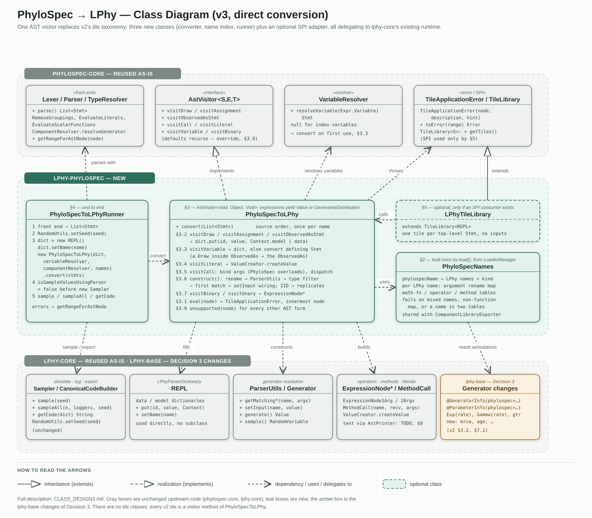

# lphy-phylospec: class design v3 — direct conversion

This document specifies how a PhyloSpec script becomes a live, sample-able, loggable LPhy model,
using as few classes and as little code as possible. v2 (`CLASS_DESIGN2.md`) used **tiled
conversion**: `phylospec-core`'s tiling framework matched tiles to the AST, and each tile built one
LPhy object. v3 uses **direct conversion**: one visitor walks the type-checked AST and builds the
LPhy objects itself, with no tiles. It keeps every feature of v2 (§6).

v2's Decision 3 is unchanged: when a PhyloSpec generator differs from its LPhy counterpart, the fix
goes into `lphy-base` (an annotation, a new constructor or a new generator), never into conversion
code. Every `lphy-base` change v2 lists (v2 §3.2, §7.1) and every construct v2 leaves uncovered
(v2 §10) carries over. Everything needed to *implement* the three classes is in this document;
references to v2 only say where an idea came from.

## Overview: three classes convert a script into an LPhy model

- **`PhyloSpecNames`** (§2) — the name index. Maps PhyloSpec generator and argument names to LPhy
  ones, read from the `phylospec` annotations, and fails loudly on a conflict.
  `ComponentLibraryExporter` reads the same annotations, so the exported component library and the
  converter always agree on names.
- **`PhyloSpecToLPhy`** (§3) — the converter. A visitor over the type-checked AST: each statement
  (`~`, `=`, `observed as`) becomes a named LPhy value in a `REPL`, and each expression (literal,
  variable, call, operator) becomes an LPhy `Value` or an unsampled `GenerativeDistribution`. It
  does everything v2 needed a dozen tile classes for.
- **`PhyloSpecToLPhyRunner`** (§4) — the entry point. Parses and type-checks the script with
  `phylospec-core`, converts it, then samples, logs or exports it with LPhy's existing `Sampler`,
  loggers and `CanonicalCodeBuilder`.

One more class is optional: **`LPhyTileLibrary`** (§5), a small adapter needed only if a generic
PhyloSpec front end has to discover LPhy as a tiling engine. The model itself lives in LPhy's own
`REPL`, so no dictionary class is needed.

```
.phylospec source
  │  Lexer, Parser, AST transforms, VariableResolver, TypeResolver   (phylospec-core, unchanged)
  ▼
type-checked AST (List<Stmt>)
  │  PhyloSpecToLPhy.convert(statements)                              (lphy-phylospec, §3)
  ▼
REPL (the LPhy model)
  │  Sampler / SimulatorListener, CanonicalCodeBuilder                (lphy-core, unchanged)
  ▼
simulated values, logged output, exported .lphy text
```

## Direct conversion is enough: for LPhy, tiling has nothing to choose

**In short:** tiling is a search over alternative translations, and v2's own decisions leave LPhy
with exactly one translation per AST node. The search therefore always returns its only candidate,
and v2 pays the framework's mechanics for nothing.

`phylospec-core`'s tiling framework (`EvaluateTiles`) collects every candidate tile for each AST node,
type-checks the candidates against each other, and picks the cheapest consistent combination. This
earns its keep for an engine where one PhyloSpec type maps to several Java shapes that must be told
apart. In v2, nothing is left to tell apart:

- **Every type check passes.** v2's Decision 1 declares every input as raw `Value` or raw
  `GenerativeDistribution`, so every candidate fits every slot (v2 §3).
- **Every generator name has one tile.** Decision 3 moves all generator mismatches into `lphy-base`,
  so each PhyloSpec name is claimed by exactly one tile (v2 §1.2, §7 item 5).
- **Every statement form has one tile.** The only overlap, `DrawTile` vs. `ObservedAsTile`, is
  already settled by the AST: an `observed as` statement is its own `Stmt.ObservedAs` node, wrapping
  the `Stmt.Draw` (`observedAs.stmt`).

Each tiling mechanic, by contrast, still costs v2 a class or a rule that is easy to get wrong. In v3
each of these becomes a plain line of visitor code:

| Tiling mechanic | Cost in v2 | In v3 |
|---|---|---|
| Inputs are found by reflecting on fields | `ReflectiveTileInput`, an overridden `getTileInputs()` that must return the same list on every call, and an overridden `getTypeToken()` (v2 §1.1) | The visitor reads the call's arguments directly |
| Tiles are copied with a no-arg constructor (`CandidateTile.createInstance`) | Every configured tile (`Reflective*Tile`, `MethodCallTile`, `MathFunctionTile`) must override `createInstance()` to copy its configuration | No tile objects to copy |
| Every AST node needs a tile, argument nodes included | A pass-through `AssignedArgumentTile` (missing from v2) | Arguments are unwrapped inside `visitCall` |
| Each tile has one fixed input list | Every overload's parameters merged into one list, all optional (v2 §1.2) | Arguments are bound against PhyloSpec's own overloads (§3.5) |
| A tile cannot see inside the tiles below it | `LPhyCall` + `LPhyCallBuilder`, so that `IIDTile` can read the inner call (v2 §1.6, §4) | `IID` reads its inner `Expr.Call` directly |
| A statement referenced later is applied through the statement that references it | Ordering depends on `EvaluateTiles`' variable jumps and memoization | Statements run in source order; a variable converts its definition on first use (§3.3) |
| Multi-statement shapes are matched by templates | `ObservedAsTile` as a `TemplateTile` (v2 §2.3) | One `visitObservedAsStmt` method |

**When to reconsider tiling.** Bring it back only if LPhy acquires a real choice between translations:
for example, several LPhy generators or Java shapes for the same PhyloSpec construct that must be
picked by type, or a pattern spanning several statements that must be rewritten into one LPhy
generator. Neither exists today. Vectorizing indexed statements (v2 §10) is a fixed rewrite that a
visitor method can do.

## Classes and what each replaces from v2

| Class | Role | Replaces from v2 | Size (estimate) |
|---|---|---|---|
| `PhyloSpecNames` | Name index: PhyloSpec generator/argument names → LPhy names, the method-call, math-function and operator tables, and the consistency checks | v2's `PhyloSpecNames` helper and `LPhyCoreTileLibrary`'s reflective sweep (v2 §7) | ~150 lines |
| `PhyloSpecToLPhy` | `AstVisitor` that turns each statement and expression into LPhy objects and fills a `REPL` | `LiteralTile`, `DrawTile`, `AssignmentTile`, `ObservedAsTile`, `ReflectiveDistributionTile`, `ReflectiveFunctionTile`, `ReflectiveTileInput`, `LPhyCall`/`LPhyCallBuilder`, `IIDTile`, `OperatorTile`, `MathFunctionTile`, `MethodCallTile`, and the missing `AssignedArgumentTile` | ~300 lines |
| `PhyloSpecToLPhyRunner` | Front end → convert → sample, log, export | same as v2 §8 | ~100 lines |
| `LPhyTileLibrary` (optional) | SPI adapter, only if a generic PhyloSpec front end must discover LPhy through `TileLibrary.loadAll` | `LPhyCoreTileLibrary`, SPI registration (v2 §9) | ~40 lines |
| — | — | `PhyloSpecLPhyDictionary`: it only added a constructor to `REPL`, so v3 uses `new REPL()` with `setName(name)` | 0 |

## 1. Conventions shared by all classes

- **Package and module.** All classes live in `lphy.phylospec.convert` (the existing exporter stays
  in `lphy.phylospec.export`). `module-info.java` already `requires org.phylospec.core` and
  `requires transitive lphy.base`; add `exports lphy.phylospec.convert`.
- **Two expression shapes.** Every expression converts to exactly one of:
  - an LPhy `Value<?>`: a literal, a variable, a function call, an operator, or a sampled random
    variable;
  - an unsampled LPhy `GenerativeDistribution<?>`: a distribution call, valid only on the right of
    `~`, in an `observed as` statement, or as `IID`'s `base` argument.

  `PhyloSpecToLPhy` checks the shape where it matters (`evalValue` / `evalDistribution`, §3.1); the
  type-checked AST guarantees the rest, because `TypeResolver` has already rejected ill-typed calls.
- **Two kinds of names.** A *PhyloSpec name* is what the script writes (`Exponential`, `rate`); an
  *LPhy name* is `@GeneratorInfo.name()` / `@ParameterInfo.name()` (`Exp`, `mean`). Only
  `PhyloSpecNames` translates between them.
- **The model is a `REPL`.** `lphy.core.parser.REPL` is LPhy's concrete `LPhyParserDictionary`. Values
  are stored with `dict.put(id, value, GraphicalModel.Context.model)` or `Context.data`, exactly as
  LPhy's own parser does. `Sampler`, the loggers, `computeLogPosterior()` and `CanonicalCodeBuilder`
  all read these two dictionaries, so they work unchanged.
- **One error type.** Every conversion failure is a
  `org.phylospec.tiling.errors.TileApplicationError(node, description, hint)`, attached to the AST
  node that failed. The runner turns it into a source range with `parser.getRangeForAstNode(node)`.
  The class comes from the tiling package, but it is a plain `RuntimeException` and needs no tiling.

## 2. `PhyloSpecNames`: one name index for converting and exporting

`PhyloSpecNames` is immutable and built once by `load()`. It reads every LPhy generator class and
the two hand-maintained tables, builds the lookups below, and checks them for conflicts.

```java
public final class PhyloSpecNames {
    public enum Kind { DISTRIBUTION, FUNCTION }

    /** One LPhy generator name grouped under a PhyloSpec name. */
    public record LPhyGenerator(String lphyName, Kind kind,
                                Map<String, String> argumentRename) {}   // PhyloSpec arg -> LPhy arg

    /** One curated method-call entry, e.g. rootAge(tree) -> tree.rootAge(). */
    public record MethodCallEntry(String lphyMethod, String receiverArgument,
                                  List<String> otherArguments) {}

    /** A PhyloSpec generator that is shorthand for IID(base(...), n), e.g.
     *  DiscreteGammaInv(shape, numCategories, numSites) -> IID(DiscreteGamma(shape, numCategories), numSites). */
    public record IIDShorthand(String baseName, String replicatesArgument,
                               Map<String, Object> defaultOnlyArguments) {}   // argument -> the only value allowed

    public static PhyloSpecNames load();                    // builds and checks; throws on conflict

    // the naming rule: the PhyloSpec name of an LPhy generator or parameter
    public static String phylospecName(Class<?> generatorClass);
    public static String phylospecName(ParameterInfo parameter);

    public List<LPhyGenerator> generators(String phylospecName);         // empty if none
    public Function<?, ?> mathFunction(String phylospecName);             // null if none
    public MethodCallEntry methodCall(String phylospecName);              // null if none
    public IIDShorthand iidShorthand(String phylospecName);               // null if none
    public BiFunction<?, ?, ?> binaryOperator(TokenType operator);        // null if none
    public Function<?, ?> unaryOperator(TokenType operator);              // null if none
}
```

### 2.1 Building the generator lookup

1. Take every class from `LoaderManager.getAllGenerativeDistributionClasses()` (kind
   `DISTRIBUTION`) and `LoaderManager.getAllFunctionsClasses()` (kind `FUNCTION`).
2. For each class, its LPhy name is `GeneratorUtils.getGeneratorName(class)`. Its PhyloSpec name is
   `@GeneratorInfo.phylospec()` if set, otherwise the LPhy name. `@GeneratorInfo` sits on the
   generating method (`sample()` / `apply()`), not on the class; `GeneratorUtils.getGeneratorInfo`
   finds it. `@GeneratorInfo.aliases()` (deprecated LPhy names) is ignored, so a PhyloSpec name is
   never matched to a deprecated LPhy name.
3. For each public constructor, from `GeneratorUtils.getParameterInfo(constructor)`: each parameter's
   PhyloSpec name is `@ParameterInfo.phylospec()` if set, otherwise `@ParameterInfo.name()`. Add
   `PhyloSpec name → LPhy name` to the `argumentRename` map of that class's LPhy name.
4. Group by PhyloSpec name: `generators(name)` returns one `LPhyGenerator` per LPhy name under it.
   Usually there is one. There are several when LPhy splits one PhyloSpec generator over differently
   named classes; for example, `Coalescent` and `CoalescentPopFunc` would both be annotated
   `phylospec = "Coalescent"`.

A rename map is kept *per LPhy name* because the same PhyloSpec argument can map to different LPhy
parameters in different LPhy generators: `populationSize` is `theta` on `Coalescent` but `popFunc` on
`CoalescentPopFunc`.

### 2.2 Building the method-call, math-function and operator tables

- **Method calls.** A hand-maintained table in `PhyloSpecNames`, like the operator table. An entry
  qualifies only when the PhyloSpec arguments are exactly the receiver plus the method's own
  arguments, in order, and names that receiver argument. Current entries: `rootAge(tree)` →
  `tree.rootAge()` and `numBranches(tree)` → `tree.branchCount()`, taken from
  `curated_equivalences.json`'s `methodCallEquivalents` (the other two entries there need argument
  adaptation). `lphy-method-calls.json` is the exporter's list of every LPhy method call, not this
  table. Anything that needs argument adaptation, chaining or a
  different return type is a new LPhy generator instead (Decision 3).
- **Math functions.** The `public static Function` factory methods on `ExpressionNode1Arg` (`sqrt()`,
  `exp()`, `log()`, …), found by reflection, keyed by method name.
- **Operators.** A `TokenType → factory` map for the PhyloSpec operators (`+`, `-`, `*`, `/`, `<`,
  `<=`, `==`, …) onto `ExpressionNode2Args`'s `public static BiFunction` methods (`plus()`, `minus()`,
  …), and onto `ExpressionNode1Arg` for unary operators. Move `EXPRESSION_OPERATOR_SCRIPT_NAMES`
  (currently private in `ComponentLibraryExporter`) into `PhyloSpecNames` so both use one table.
- **IID shorthands.** A hand-maintained table of PhyloSpec generators that are an `IID` of another
  PhyloSpec generator, converted through the `IID` path (§3.6). The one entry so far:
  `DiscreteGammaInv` → base `DiscreteGamma`, replicates argument `numSites`, default-only argument
  `invariantProportion = 0`. `DiscreteGamma` is already LPhy's `DiscretizeGamma` (curated in
  `curated_equivalences.json`), so `DiscreteGammaInv(shape=γ, numCategories=4, numSites=200)` becomes
  `DiscretizeGamma(shape=γ, ncat=4, replicates=200)`, exactly as `examples/coalescent/gtrGammaCoalescent.lphy`
  writes it. A default-only argument may be omitted or given its default as a literal; any other value is
  `unsupported`, because LPhy has no proportion of invariant sites here.

### 2.3 Checks that fail loudly

`load()` throws if any of these is violated, naming the classes involved:

1. **One PhyloSpec name per LPhy name.** Every class registered under one LPhy name resolves to the
   same PhyloSpec name. `ParserUtils` looks generators up by LPhy name and returns every class under
   it (`"Coalescent"` returns both `Coalescent` and `SerialCoalescent`), so if only one of them set
   `phylospec = "X"`, a call to `X` could construct the other.
2. **Each rename map is a function.** Within one LPhy name, a PhyloSpec argument maps to the same
   LPhy argument in every constructor and class, because `ParserUtils` resolves all of them from one
   argument map.
3. **No PhyloSpec name in two tables.** A name is a generator, a math function, a method call or an
   IID shorthand, never two of them. `taxon` (§3.9) is reserved too: it must not resolve to a generator.

### 2.4 Shared with `ComponentLibraryExporter`

LPhy names and PhyloSpec names are never mixed. In the exported component library, a generator's or
argument's `name` is always its LPhy name, as written in an LPhy script (`jukesCantor`, `meanlog`); its
PhyloSpec name, when an annotation sets one, goes only into the separate `phylospec` property
(`jc69`, `logMean`). `curated_equivalences.json` and `compare_component_libraries.py` rely on this:
their `lphy` side is the LPhy name.

The exporter writes `phylospec` from the same `@GeneratorInfo.phylospec()` /
`@ParameterInfo.phylospec()` annotations that `PhyloSpecNames` reads, so the exported library and the
converter cannot disagree on a name.

## 3. `PhyloSpecToLPhy`: converting the AST in one visitor

```java
public class PhyloSpecToLPhy implements AstVisitor<Void, Object, Void> {
    private final REPL dict;                             // the model being built
    private final VariableResolver variableResolver;     // from the front end
    private final ComponentResolver componentResolver;   // the instance TypeResolver used (§3.5)
    private final PhyloSpecNames names;
    private final Map<Stmt.Draw, Stmt.ObservedAs> observedDraws = new IdentityHashMap<>();

    public PhyloSpecToLPhy(REPL dict, VariableResolver variableResolver,
                           ComponentResolver componentResolver, PhyloSpecNames names);

    /** Converts all top-level statements, in source order, into dict. */
    public void convert(List<Stmt> statements);

    // statements (§3.2):   visitDraw, visitAssignment, visitObservedAsStmt
    // expressions:         visitVariable (§3.3), visitLiteral (§3.4), visitCall (§3.5–§3.8),
    //                      visitBinary, visitUnary (§3.7), visitArray (§3.9)
    // all other visit methods: throw unsupported(node) (§3.10)

    private Object eval(AstNode node);                              // §3.1
    private Value<?> evalValue(Expr expr);                          // §3.1
    private GenerativeDistribution<?> evalDistribution(Expr expr);  // §3.1
    private Map<String, Expr> bindArguments(Expr.Call call);        // §3.5
    private Object construct(String phylospecName, Map<String, Value> arguments);  // §3.6
    private TileApplicationError unsupported(AstNode node);         // §3.10
}
```

`convert` first fills `observedDraws` (the `Stmt.Draw` inside each top-level `Stmt.ObservedAs`), then
calls `stmt.accept(this)` on each top-level statement.

### 3.1 Every node is evaluated through one error-attributing helper

All recursion goes through `eval`, so every failure is attributed to the innermost node that failed:

```java
private Object eval(AstNode node) {
    try {
        return node instanceof Expr e ? e.accept(this) : ((Stmt) node).accept(this);
    } catch (TileApplicationError e) {
        throw e;                                    // already attributed to an inner node
    } catch (RuntimeException e) {
        throw new TileApplicationError(node, "Creating the LPhy objects did not work.", e.getMessage());
    }
}
```

`evalValue(expr)` calls `eval(expr)` and throws at `expr` unless the result is a `Value`.
`evalDistribution(expr)` does the same for a `GenerativeDistribution`. These two are the only shape
checks in the converter.

### 3.2 Statements fill the data and model dictionaries

Each named statement is converted at most once: before converting, the visitor checks whether the
name is already in `dict` (it may have been converted through a variable reference, §3.3) and skips
it if so.

| Statement | Conversion |
|---|---|
| `Stmt.Draw` (`~`) | `dist = evalDistribution(stmt.expression)`; `rv = dist.sample(stmt.name)`; `dict.put(stmt.name, rv, Context.model)`. `sample(id)` is what LPhy's own parser calls; it names the variable, including the components of a vectorized one |
| `Stmt.Assignment` (`=`) | `v = evalValue(stmt.expression)`. If `v` already has an id (`y = x`), fail with "aliasing a variable is not supported"; renaming `v` would silently rename `x`. Otherwise `v.setId(stmt.name)`; `dict.put(stmt.name, v, Context.model)` |
| `Stmt.ObservedAs` | see below |
| anything else | `unsupported(stmt)` (§3.10) |

**`observed as` uses LPhy's data clamping.** In LPhy, an observed variable is a value in the `data`
dictionary and a random variable in the `model` dictionary, both under the same id. The converter
builds exactly what `LPhyListenerImpl` builds for that case (`LPhyListenerImpl.java:286–302`):

1. `draw = (Stmt.Draw) stmt.stmt`; `dist = evalDistribution(draw.expression)`;
   `obs = evalValue(stmt.observedAs)`.
2. `obs` must be anonymous (for example `observed as fromFasta(...)`). If it already has an id
   (`observed as alignment`), fail with "observe an expression, not a variable": registering it
   under a second id would break LPhy's rule that a data value and its random variable share one id.
   Otherwise `obs.setId(draw.name)`.
3. Build the random variable from `obs.value()`:
   - if `dist` is a `VectorizedDistribution` or an `IID` and the value is an array:
     `rv = ObservationUtils.setObservationsToVectorizedRandomVariable((Object[]) value, draw.name, dist)`,
     using the overload for `dist`'s class (there is one for `VectorizedDistribution` and one for `IID`);
   - otherwise `rv = new RandomVariable(draw.name, value, dist)`; `rv.setObserved(true)`.
4. `dict.put(draw.name, obs, Context.data)` and `dict.put(draw.name, rv, Context.model)`.

`GraphicalModel.isObserved(id)` and `computeLogPosterior()` read these two dictionaries, so they treat
the variable as observed with no further work.

### 3.3 Variables are converted on first use

`visitVariable(expr)` returns the value stored under `expr.variableName`, looking in the model
dictionary and then the data dictionary. If the name is not there yet, it converts the defining
statement first and then returns the value:

1. `def = variableResolver.resolveVariable(expr)`. If it is `null`, the name is an index variable
   (`for i in ...`): `unsupported(expr)`.
2. If `def` is a key of `observedDraws`, convert that `Stmt.ObservedAs` instead, so an observed
   variable is never first created unobserved.
3. `eval(def)`, then return the stored value.

Statements are visited in source order, so step 3 runs only for a forward reference, and for the
`LPhyTileLibrary` adapter (§5), which converts one statement at a time.

### 3.4 Literals become anonymous constants

`visitLiteral(expr)` returns `ValueCreator.createValue(expr.value, null)`. It dispatches on the
runtime type and returns an anonymous (`id == null`) `IntegerValue`, `DoubleValue`, `BooleanValue` or
`StringValue`, exactly like a literal in a `.lphy` script. A literal with an explicit unit
(`expr.unit != Unit.IMPLICIT`) is `unsupported`. Whether `2` should become a `DoubleValue` in a
`Real`-typed slot is open (§8).

### 3.5 Calls are dispatched by name, after binding arguments the PhyloSpec way

`visitCall(call)` first binds the arguments, then dispatches on `call.functionName`. The front end
used here leaves `functionName` as the bare name (`Normal`): only the `AttachComponentNamespaces`
transform adds a namespace prefix (`core.Normal`), and only `JSONConverter` runs it. The runner must
not run it.

**Binding arguments.** PhyloSpec lets a script omit an argument name in two cases: when the argument
is a variable with the same name as a parameter (`Yule(birthRate, taxa)`), and when it is the only
argument and the generator has exactly one required parameter (`sqrt(x)`). `Expr.Call.resolveArgumentNames`
implements both rules, but it needs PhyloSpec's real parameter list with real required flags. That list
comes from PhyloSpec's own component library, not from LPhy:

```java
private Map<String, Expr> bindArguments(Expr.Call call) {
    for (Generator overload : componentResolver.resolveGenerator(call.functionName)) {
        List<Expr.Call.Parameter> params = overload.getArguments().stream()
                .map(a -> new Expr.Call.Parameter(a.getName(), Boolean.TRUE.equals(a.getRequired())))
                .toList();
        try {
            Map<String, Expr> bound = new LinkedHashMap<>();
            call.resolveArgumentNames(params).forEach((name, arg) -> bound.put(name, unwrap(arg)));
            return bound;
        } catch (ArgumentResolutionError e) { /* try the next overload */ }
    }
    throw new TileApplicationError(call, "No overload of " + call.functionName + " matches", null);
}
```

`unwrap` returns `arg.expression` for an `Expr.AssignedArgument` and throws `unsupported` for an
`Expr.DrawnArgument` (§3.10). `TypeResolver` has already checked that some overload matches, so the
error above signals a bug, not a user mistake. Pass the same `ComponentResolver` instance that
`TypeResolver` used, so that the script's `import` statements are already applied.

**Dispatch.** `PhyloSpecNames` guarantees each name is in at most one table (§2.3), so the order below
does not matter:

| `call.functionName` | Conversion |
|---|---|
| `IID` | §3.6, `IID` paragraph |
| `names.iidShorthand(name) != null` | §3.6, IID shorthand paragraph |
| `taxon` | `unsupported(call)` unless it is an element of an array (§3.9): LPhy has no single-taxon generator |
| `names.mathFunction(name) != null` | §3.7 |
| `names.methodCall(name) != null` | §3.8 |
| `!names.generators(name).isEmpty()` | evaluate each bound argument with `evalValue`, then `construct(name, values)` (§3.6) |
| otherwise | `unsupported(call)` — a PhyloSpec generator with no LPhy counterpart yet |

### 3.6 Generator calls are built by LPhy's own resolver

`construct(phylospecName, arguments)` builds a generator the same way LPhy's parser does for a
hand-written `.lphy` call, by delegating to `ParserUtils`. `ParserUtils` already resolves overloads,
explicit `replicates` (`IID.match`) and implicit vectorization (`VectorMatchUtils`):

1. **Rename.** For each `LPhyGenerator g` in `names.generators(phylospecName)`, rename the argument
   keys with `g.argumentRename()`. If any key has no entry, skip `g`: it has no constructor taking
   that argument.
2. **Match.** Call `ParserUtils.getMatchingGenerativeDistributions(g.lphyName(), renamed)` if
   `g.kind()` is `DISTRIBUTION`, otherwise `ParserUtils.getMatchingFunctions(g.lphyName(), renamed)`.
   Concatenate the matches of every `g`, remembering each match's renamed argument map.
3. **Filter by type.** `ParserUtils` matches argument *names* only, so drop direct matches whose
   parameter types do not accept the supplied values. A match is kept if it is an `IID`,
   `VectorizedDistribution` or `VectorizedFunction` (those wrappers exist because an array was passed
   to a scalar parameter, and `ParserUtils` has already type-checked them against the component
   type). Otherwise it is kept if some public constructor of its class has, for every supplied
   argument, an `Argument a` in `ArgumentUtils.getArguments(constructor)` with that name and
   `a.type.isAssignableFrom(value.value().getClass())`. Without this filter,
   `Coalescent(populationSize = popFunc)` would match `Coalescent(theta = popFunc)` as well as
   `CoalescentPopFunc(popFunc = popFunc)`.
4. **Pick.** No match: fail at the call node, listing the LPhy names tried. Several matches: log
   `"Found N matches for <name>. Picking first one!"` and take the first, which is what
   `LPhyListenerImpl` does (`LPhyListenerImpl.java:573–575`), so a converted model and a hand-written
   script resolve the same call to the same generator.
5. **Wire outputs.** For each entry of the chosen match's renamed argument map, call
   `generator.setInput(lphyName, value)`. The constructor has already stored the parameter, but
   `setInput` also calls `value.addOutput(generator)`, the only place `Value.getOutputs()` is filled.
   LPhy's parser does the same (`LPhyListenerImpl.java:576–578`, *"must be done so that Values all know
   their outputs"*); without it `getDataModelSinks()` treats every named value as a sink.
6. **Return.** A distribution is returned unsampled (the statement samples it, §3.2). A function
   returns `generator.generate()`, a `Value`.

**`IID(base, num)`** has no LPhy generator: LPhy writes it as one more argument, `replicates`, on the
base distribution's own call. So `visitCall` does not evaluate `base`. It requires `base` to be an
`Expr.Call` (otherwise it fails with "IID base has no LPhy equivalent"), binds the inner call's
arguments with `bindArguments`, evaluates them, adds `IID.REPLICATES_PARAM_NAME` (`"replicates"`) →
`evalValue(num)`, and calls `construct(innerName, arguments)`. `IID.match` in `ParserUtils` then builds
the vectorized distribution. Because the inner arguments are renamed exactly as for a plain call,
`IID(Yule(birthRate=b, …), n)` becomes `Yule(lambda=b, …, replicates=n)`.

**IID shorthands** (§2.2) take the same path. For `sh = names.iidShorthand(name)`: bind the call's own
arguments with `bindArguments`; check each of `sh.defaultOnlyArguments()` is absent or a literal equal to
its default (otherwise `unsupported`) and drop it; take `sh.replicatesArgument()` out as `num`; then
continue as `IID(sh.baseName()(remaining arguments), num)`. So
`DiscreteGammaInv(shape=γ, numCategories=4, numSites=200)` becomes
`DiscretizeGamma(shape=γ, ncat=4, replicates=200)`, a `Double[]` of 200 site rates.

### 3.7 Operators and math functions become LPhy expression nodes

LPhy's operators and math functions are not generator classes. They are `public static` factory
methods, wrapped in an expression node:

```java
new ExpressionNode2Args(text, binaryFactory, left, right)   // ExpressionNode2Args(String, BiFunction, GraphicalModelNode...)
new ExpressionNode1Arg(text, unaryFactory, arg)             // ExpressionNode1Arg(String, Function, GraphicalModelNode...)
```

- `visitBinary(expr)`: factory `names.binaryOperator(expr.operator)`, operands
  `evalValue(expr.left)`, `evalValue(expr.right)`.
- `visitUnary(expr)`: factory `names.unaryOperator(expr.operator)`, operand `evalValue(expr.right)`.
- A math-function call (`sqrt(x)`): factory `names.mathFunction(name)`, operand the single bound
  argument.

A `null` factory means LPhy has no such operator: `unsupported(expr)`. LPhy has no unary minus,
so `-x` is one. Each node's `apply()` returns its `Value`. `text` is the expression's source text:
LPhy's parser passes `ctx.getText()`, and `CanonicalCodeBuilder` prints it when exporting, so it must
be LPhy syntax. `AstPrinter` cannot be used: it renders S-expressions such as `(> s 1.0)`. The
converter builds `text` from the evaluated operands instead: a named operand prints its id, any other
its `codeString()` (in brackets if it is itself a binary operation), joined by the operator's lexeme
(`TokenType.getLexeme`), which LPhy writes the same way; a math function prints `name(operand)`.
`Expr.Grouping` never reaches the visitor: the front end's `RemoveGroupings` transform removes
parentheses.

### 3.8 Method calls become LPhy `MethodCall`s

For `entry = names.methodCall(name)`: evaluate the bound argument `entry.receiverArgument()` as the
receiver, and `entry.otherArguments()`, in order, as the method's arguments. Then return
`new MethodCall(entry.lphyMethod(), receiver, args).apply()`. `MethodCall` performs the same reflective
`@MethodInfo` lookup as `receiver.method(args)` in a `.lphy` script; turn its checked
`NoSuchMethodException` into a `TileApplicationError` at the call node.

### 3.9 Arrays become LPhy array functions; an array of `taxon` calls becomes `taxa(...)`

`visitArray(expr)` has two cases.

**An array of `taxon(...)` calls is a `Taxa`.** PhyloSpec's `Taxa` is an alias of `Vector<Taxon>`, so a
script without data writes its taxa as `[taxon(name="a"), taxon(name="b", age=2.0), …]`. LPhy has no
single-taxon generator; it builds the whole set at once with `taxa(names, species, ages)`
(`CreateTaxa`), whose three arguments are parallel arrays. So if every element is an `Expr.Call` to
`taxon`, the converter transposes the calls into columns:

1. Bind each element's arguments with `bindArguments` (`taxon(name, species, age)`).
2. `names` = the array (below) of every element's `name`.
3. `species` = the array of every element's `species`, if every element sets it; omitted if none does;
   `unsupported` if only some do, because `CreateTaxa` needs one species per taxon.
4. `ages` = the array of every element's `age`, using a literal `0.0` (PhyloSpec's default) for an
   element without one; omitted if no element sets an age.
5. Return `construct("taxa", {names, species?, ages?})` (§3.6). `taxa` also names `TaxaFunction`
   (`taxa(alignment)`), but only `CreateTaxa` has a `names` parameter, so `ParserUtils` picks it.

Tree generators take the result as their `taxa`. Properties of the resulting `Taxa` are read with
`Taxa`'s own `@MethodInfo` methods (`taxaNames()`, `species()`, `ages()`, `length()`) through the
method-call table (§3.8). An array that mixes `taxon` calls with anything else, or of `Taxon` values that
are not `taxon` calls, is `unsupported`.

**Any other array** becomes an LPhy array value built the way LPhy's parser builds `[a, b, …]`
(`LPhyListenerImpl.visitArray_construction`, `LPhyListenerImpl.java:623–704`): evaluate each element
with `evalValue`, pick the array function from `ArrayCreator.getType(values)` (`DoubleArray`,
`IntegerArray`, `BooleanArray`, `StringArray`, `NumberArray`, their 2D forms, or `ObjectArray`), call its
`apply()`, and, if every element is a constant, `setFunction(null)` so the array exports as one literal.
That logic is private to `LPhyListenerImpl`; move it into a public
`ArrayCreator.createArrayValue(Value[])` in `lphy-core` and call it from both, rather than copying it.
`Vector<Real> rates = [1.0, 1.0, 1.0]` becomes a `DoubleArray`, which `PhyloCTMC` takes as `siteRates`.

### 3.10 Unsupported forms fail clearly

`unsupported(node)` returns `new TileApplicationError(node, "Not supported by LPhy yet", hint)`. The
visitor must override every `AstVisitor` method it does not implement and throw it: `AstVisitor`'s
default methods recurse and return `null`, so a missing override would hide the problem until some
later step fails on a `null`. The forms are:

- statements: `Stmt.Indexed`, `Stmt.ObservedBetween`, `Stmt.Decorated`, `Stmt.Import` (an import
  has already been applied by the front end, so `convert` can skip it instead);
- expressions: `Expr.Index`, `Expr.Range`, `Expr.DrawnArgument`, `Expr.StringTemplate`,
  `Expr.TemplateVariable`, `Expr.OptionalTemplateVariable`.

Each is a candidate for a later visitor method (§6.2).

## 4. `PhyloSpecToLPhyRunner`: running a script end to end

1. **Front end** (`phylospec-core`): `Lexer.scanTokens()` → `Parser.parse()` → `RemoveGroupings`,
   `EvaluateLiterals`, `EvaluateScalarFunctions` → `new VariableResolver(statements)` →
   `TypeResolver(componentResolver).visitStatements(statements)`, where
   `componentResolver = new ComponentResolver(ComponentResolver.loadCoreComponentLibraries())`. Do not
   run `AttachComponentNamespaces` (§3.5). Report a `TypeError` at
   `parser.getRangeForAstNode(error.getAstNode())`.
2. **Seed**: `RandomUtils.setSeed(seed)` once, if `-seed` is given, so the values drawn during
   conversion (§3.2) can be reproduced.
3. **Convert**: `REPL dict = new REPL(); dict.setName(name);`
   `new PhyloSpecToLPhy(dict, variableResolver, componentResolver, PhyloSpecNames.load()).convert(statements);`
   Report a `TileApplicationError` the same way as a `TypeError`.
4. **Resample in place**: save `LPhyParserDictionary.Utils.isSampleValuesUsingParser()`, set it to
   `false` **before** constructing `Sampler`, and restore it when done. `Sampler` reads the flag in a
   field initializer (`Sampler.java:31`). With `true`, it would print the model with
   `CanonicalCodeBuilder` and re-parse it as `.lphy` on every sample. That works, but is wasted work.
   The flag is JVM-global, hence the restore.
5. **Simulate and log, the way `slphy` does** (`NamedRandomValueSimulator.simulateAndLog` and
   `simulate`). Do not use `Sampler.sampleAll` with `FileLoggerListener`: `sampleAll` calls
   `logger.start(numReplicates)` with one argument, and `FileLoggerListener.start` accepts only
   `(FileConfig)`, `(Integer, String)` or `(Integer, File, Long)`, so it throws.
   1. `FileLoggerListener logger = new FileLoggerListener(); logger.setOutputDir(outDir);`
      `logger.start(numReplicates, filePrefix)`, where `filePrefix` is the script's file name without
      `.phylospec`.
   2. Replicate 0 is the model as converted:
      `values = GraphicalModelUtils.getAllValuesFromSinks(dict)`.
   3. Replicates 1 to n-1: `values = sampler.sample(null)`, with `sampler = new Sampler(dict)`. Pass
      `null`, not the seed: `sample(seed)` re-seeds on every call, which would make every replicate
      identical to replicate 1.
   4. For each replicate, `logger.replicate(i, NamedRandomValueSimulator.getNamedRandomValues(values,
      varNotLog))`; then `logger.complete()`. `FileLoggerListener` writes the same files as `slphy`:
      numeric values to `<prefix>.log` (only if there are any), trees to `<prefix>_<tree id>.trees`,
      and each alignment to its own Nexus file, `<prefix>_r<i>_<id>.nexus` when n > 1.
6. **Export** the converted model with `new CanonicalCodeBuilder().getCode(dict)` to
   `<outDir>/<prefix>.lphy`, so the simulation can be rerun or checked with `slphy` itself.

The command line mirrors `slphy` (`SLPhy.java`), using picocli, which `lphy-core` already exports:

```
PhyloSpecToLPhyRunner <file.phylospec> [-r|--replicates n] [-seed|--seed s]
                      [-No|--notlog id;id…] [-o|--outdir dir]
```

`-r` defaults to 1; without `-seed` the seed is random; `-No` lists random variables not to log, as in
`slphy`; `-o` defaults to the script's own directory, which is where `slphy` writes. `slphy`'s `-D`
(replace a constant) has no PhyloSpec equivalent and is left out.

`StochasticityResolver` is not needed: tiling used it to reject tiles that cannot take a stochastic
input, and every LPhy generator can.

## 5. Optional: `LPhyTileLibrary` for the `TileLibrary` SPI

This adapter is only needed if a generic PhyloSpec front end, rather than `PhyloSpecToLPhyRunner`, has
to discover the LPhy engine through `TileLibrary.loadAll`. Whether one exists is open (§8). If it does:

- `LPhyTileLibrary extends TileLibrary<REPL>`; `getStateType()` returns `REPL.class` and `getTiles()`
  returns one tile.
- That tile, an inner class, accepts every top-level `Stmt`, declares no inputs, and in `applyTile`
  converts its statement with a `PhyloSpecToLPhy` bound to the state. `EvaluateTiles` applies only the
  statements that no later statement references; the others are converted when first referenced
  (§3.3).
- Register it in `META-INF/services/org.phylospec.tiling.TileLibrary` and with
  `provides org.phylospec.tiling.TileLibrary with LPhyTileLibrary` in `module-info.java`.

`EngineSpecGenerator` lists an engine's generators from its `GeneratorTile`s, and this adapter has
none. LPhy publishes what it supports through `ComponentLibraryExporter`'s
`phylospec-lphy-component-library.json` instead.

## 6. Compared with v2

### 6.1 Every v2 feature is kept

| v2 feature | v3 |
|---|---|
| Generator calls by name, renames by annotation (v2 §1) | §2.1, §3.6 |
| Constructor overloads, type filter, first match with warning, output wiring (v2 §1.2–§1.6) | §3.5, §3.6 |
| Literals (v2 §1.5) | §3.4 |
| `~`, `=`, `observed as` (v2 §2) | §3.2 |
| Method calls (v2 §3.3) | §2.2, §3.8 |
| `IID` → `replicates` (v2 §4) | §3.6 |
| Operators and math functions (v2 §5) | §2.2, §3.7 |
| `REPL`-based model, `Sampler`, loggers, in-place resampling (v2 §6) | §1, §4 |
| `.lphy` export (v2 §6.1) | §4 step 5 |
| Name consistency and collision checks (v2 §7) | §2.3 |
| `lphy-base` changes (v2 §3.2, §7.1) | unchanged (Decision 3) |
| Errors attributed to AST nodes (v2 §3) | §3.1, at the innermost node |
| SPI registration (v2 §9) | §5, optional |
| Not yet covered (v2 §10) | unchanged; §3.10 lists the forms |
| TODO (v2 §11) | §8; seeding is closed (§4 step 2) |

### 6.2 What v3 does better

- **Arguments bind exactly as PhyloSpec defines.** Omitted argument names (a variable named like the
  parameter, or a single argument) resolve against PhyloSpec's own overloads (§3.5). v2 bound against
  a merged list with every input optional, which rejects an unnamed single argument such as
  `Exponential(1.0)`.
- **Observed vectors work.** `observed as` with an `IID` or vectorized distribution and array data
  clamps every component, as LPhy does (§3.2). v2 handled only the scalar case.
- **Two silent renames become errors.** `y = x` and `observed as someVariable` used to rename an
  existing value; v3 rejects both (§3.2).
- **Errors point at the innermost failing node** (§3.1), not at a tile's root.
- **Uncovered forms are cheap to add.** Each item in v2 §10 is a visitor method, not a tile class.
  `Expr.Array` is already one (§3.9); still to come: `Expr.Index` → `ElementsAt`/`Slice`, `Expr.Range` →
  `rangeInt`, `Expr.DrawnArgument` → sample, register and return the variable. Indexed statements can
  be vectorized by rewriting `x[i] ~ D(a[i]) for i in 1:n` to `x ~ D(a)`.

### 6.3 What v3 gives up

- **Tiling-time diagnostics.** Unsupported constructs are reported while converting rather than by
  `EvaluateTiles`' failure-cascade analysis before anything is built. v2 had already accepted this for
  everything except unknown argument names (v2 §3), which `TypeResolver` rejects before conversion
  anyway.
- **Mixing tile libraries.** A tile library can, in principle, be combined with other libraries for the
  same state type. Nothing used this, and `REPL` is LPhy-only.

## 7. Implementation order and acceptance tests

Each step ends with tests that must pass before the next starts.

1. **`PhyloSpecNames`** (§2). Tests: `generators("Normal")` returns `Normal` with an identity rename map;
   after annotating `LogNormal`, `generators("LogNormal")` maps `logMean → meanlog`, `logSd → sdlog`;
   a test-only pair of conflicting annotations makes `load()` throw (§2.3). No AST is needed.
2. **`PhyloSpecToLPhy` core**: §3.1–§3.6 without `IID`. Test on this script:
   ```
   Real mu ~ Normal(mean=0.0, sd=1.0)
   Real sigma ~ LogNormal(logMean=0.0, logSd=0.5)   // needs the LogNormal rename annotations
   Real x ~ Normal(mean=mu, sd=sigma)
   ```
   Expect `dict` to hold random variables `mu`, `sigma`, `x`; `x`'s generator is a `Normal` whose
   `mean` parameter is the same object as `mu`; `mu.getOutputs()` contains that `Normal`.
3. **`PhyloSpecToLPhyRunner`** (§4). Tests: the script above, run twice with the same `-seed`, logs
   the same values; with `-r 3` the three replicates differ; `CanonicalCodeBuilder` output parses as
   `.lphy` and yields the same three variables.
4. **Arrays, taxa and IID shorthands** (§3.6, §3.9), driven by the two data-free examples, each run
   end to end through the runner and round-tripped through `.lphy` export:
   - `examples/simLiteralSiteRates.phylospec`: `taxa` becomes `taxa(names=["a","b","c","d"])`; `rates`
     is a constant `DoubleArray`; the logged alignment has 4 taxa and 5 sites.
   - `examples/simDiscreteGammaSites.phylospec`: `rates ~ DiscreteGammaInv(…, numSites=200)` becomes
     `DiscretizeGamma(shape=0.5, ncat=4, replicates=200)`; the logged alignment has 4 taxa and 200 sites.
   - Failure cases: `invariantProportion=0.1` and a `taxon(...)` outside an array are each rejected at
     the right node with "Not supported by LPhy yet"; an array where only some taxa set `species` is
     rejected.
5. **Remaining converter features**: `observed as` (scalar and `IID` array), `IID`, operators and math
   functions, method calls (§3.2, §3.6–§3.8). One test script per feature, each also round-tripped
   through `.lphy` export.
6. **`lphy-base` changes** (Decision 3), one generator at a time, driven by v2 §7.1, each with the
   unit tests listed in §8.
7. **`LPhyTileLibrary`** (§5), only if an SPI consumer exists.

## 8. TODO

- **Decide whether the `TileLibrary` plug-in is needed.** `LPhyTileLibrary` (§5) is only worth
  building if a generic PhyloSpec front end, not `PhyloSpecToLPhyRunner`, has to find the LPhy engine
  through `TileLibrary.loadAll`. Find out whether such a consumer exists or is planned. Even then,
  `EngineSpecGenerator` cannot list LPhy's generators from it; `phylospec-lphy-component-library.json`
  stays the published list.
- **Rename data: the `@GeneratorInfo.phylospec()`/`@ParameterInfo.phylospec()` annotations are not
  populated yet.** Matching names need no annotation, since `name()` is used directly. Every name that
  differs depends on these annotations (§2.1). There are currently no `phylospec =` attributes anywhere
  in `lphy-base` (they were removed from `HKY.java`). v2 §7.1's first row lists the known renames;
  complete it parameter by parameter against the coverage report's In-both tables. Add a unit test on
  `PhyloSpecNames` asserting that every PhyloSpec overload in `phylospec-core-component-library.json`
  that LPhy claims to support resolves, by name or annotation, to exactly one LPhy constructor. The
  same check can run in `compare_component_libraries.py`, so the coverage report and the converter
  cannot drift apart.
- **Annotations and one `lphy-core` change needed by the two data-free examples** (§7 step 4). They
  come before the general rename work above, and are the minimum for both examples to run:
  - `JukesCantor`: `@GeneratorInfo(phylospec = "jc69")`;
  - `Yule`: `lambda` gets `@ParameterInfo(phylospec = "birthRate")`;
  - `PhyloCTMC`: `Q` gets `@ParameterInfo(phylospec = "qMatrix")`;
  - `DiscretizedGamma`: `@GeneratorInfo(phylospec = "DiscreteGamma")`, and `ncat` gets
    `@ParameterInfo(phylospec = "numCategories")`, so that the `DiscreteGammaInv` shorthand (§2.2) finds it;
  - `lphy-core`: move `LPhyListenerImpl`'s array construction into a public
    `ArrayCreator.createArrayValue(Value[])` (§3.9), and call it from `LPhyListenerImpl`.

  `CreateTaxa` needs nothing: the converter calls it with its own LPhy argument names (§3.9).
- **`lphy-base` changes from Decision 3, step 2** (v2 §3.2, §7.1): `Exp(rate)`, `Gamma(rate)`, the
  `gtr` six-rate constructor, and optionally `LogNormal(mean, sdlog)`. Each needs unit tests for the
  four consistency rules in v2 §3.2: `getParams` returns only the parameters given, `setParam` accepts
  every parameter name, conversions are computed lazily from the stored `Value`s, and mutually
  exclusive parameters are validated in the constructor.
- **Literal numeric types.** `visitLiteral` (§3.4) turns `kappa=2` into an `IntegerValue`, and vector
  literals raise the same question (`Integer[]` vs. `Double[]`). LPhy generators handle this by calling
  `.doubleValue()` on `Number`-typed parameters. Verify that this covers every slot declared as
  `Value<Double>` rather than `Value<Number>` (e.g. `k80.kappa`, `ExpMarkovChain.initialMean`,
  `PhyloBrownian.diffRate`, `PhyloOU`'s parameters). If not, `visitLiteral` can produce a `DoubleValue`
  for `Real`-typed literals, using `TypeResolver`'s type for the literal node.
- **Observing a named variable** (§3.2, step 2). `observed as alignment`, where `alignment` is defined
  by its own statement, is rejected for now. Supporting it needs a rule for which id the data value
  carries, since LPhy requires the data value and the random variable to share one.

## Class diagram

See [`class-diagram3.svg`](class-diagram3.svg); open it in a browser for a zoomable view. It is
hand-written SVG, edited as text with no build step, in the same style as v2's diagram. Gray boxes are
unchanged upstream code (`phylospec-core`, `lphy-core`); teal boxes are the new classes; the dashed
teal box is the optional `LPhyTileLibrary` (§5); the amber box holds the `lphy-base` changes of
Decision 3.


